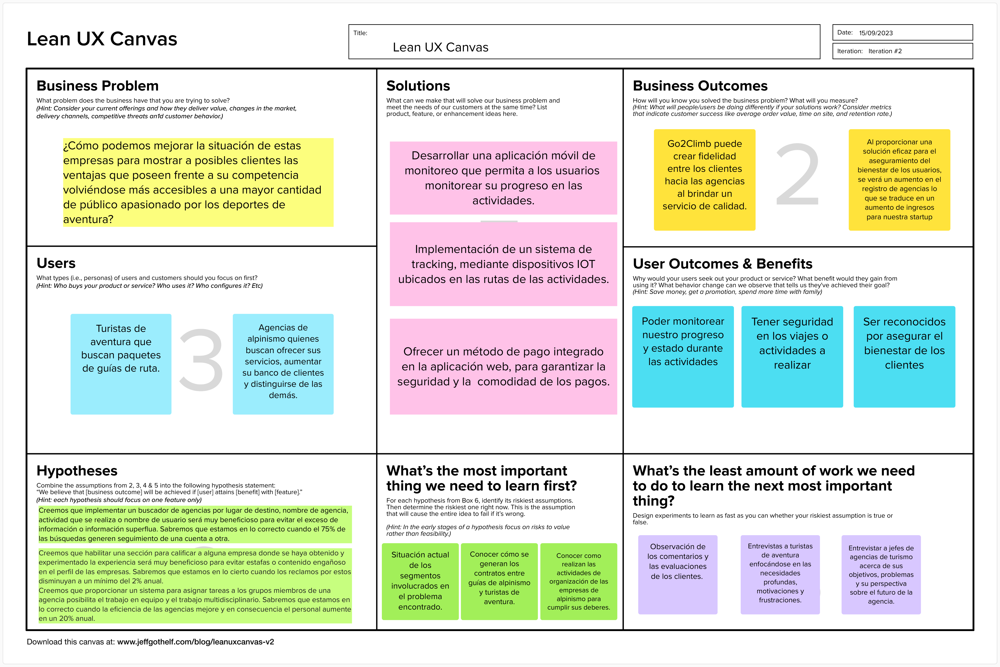

### Startup Profile

#### Descripción de la Startup

SoftTech es una innovadora startup dedicada a transformar la forma en que los apasionados por el alpinismo, el senderismo y ciclocrós disfrutan de sus aventuras al aire libre. Nuestra pasión por la tecnología y el amor por la naturaleza nos han llevado a crear ‘Go2Climb’, una solución inteligente que busca liderar en la industria que impulsa la seguridad y el rendimiento en el deporte al aire libre. Go2Climb es nuestra solución emblemática que aprovecha la tecnología IoT de vanguardia y los principios de fog computing para ofrecer una experiencia sin igual.

**Nuestra misión:** Empoderar a los amantes de la naturaleza y a los deportes al aire libre al proporcionar soluciones tecnológicas inteligentes que mejoren su experiencia y seguridad.

**Nuestra visión:** Liderar la revolución de la tecnología en le mundo de los deportes al aire libre. Visualizamos un futuro en el que cada deportista, haciendo que las agencias de estos deportes cuenten con nuestra solución y brinde seguridad a los usuarios.

#### Perfiles de integrantes del equipo

!include (../partials/team-members.html)

### Solution Profile

**Nombre del producto:** Go2Climb

Nuestra solución es un dispositivo capaz de brindar cobertura en las rutas de las actividades, estos dispositivos son capaces de brindar conexión en la cual el usuario pueda ver su ubicación desde nuestra aplicación, también puede visualizar el clima y salud del usuario. Esto permite que las agencias tengan forma de dar seguimiento a sus clientes y en caso de ocurrir un accidente, de inmediatamente puedan auxiliar a afectado.

#### Antecedentes y problemática

El problema que observamos es la cantidad de personas que sufren accidentes haciendo estos deportes y la principal razón por la que el problema existe es la informalidad y que las rutas de estas actividades no son seguras o no cuentan con un sistema para confiar la seguridad. Los negocios informales son un problema en la economía del Perú, sin embargo, en el sector turístico existe un impacto bastante negativo. Esto también es impulsado por la ignorancia de las personas, que no saben la existencia de las plataformas donde puedan encontrar agencias que brinden estos deportes. Todo esto sumado a la ausencia de señal o cobertura de red en las rutas de los deportes, hace que estos deportes se vuelvan en un problema para la seguridad e integridad de las personas que practican estos deportes.

Analizamos la problemática mediante la técnica de las 5W (_Who, What, Where, Why, When_), y las 2H (_How, How Much_):

- **WHAT**: El problema es la enorme cantidad de informalidad en el sector de las agencias que brindan un servicio de actividades al aire libre, produciendo una enorme cantidad de accidentes en estas actividades.
- **WHEN**: El problema en cuestion se puede observar cuando hay muy poca informacion respecto a este tipo de actividades en el Peru, y generalmente afecta al sector turistico. Entonces como tal no hay un momento del dia o proceso donde se pueda especificar el problema , puede estar todo el tiempo.
- **WHERE**: Este problema se puede observar mucho en el sector turistico, donde se realiza estas actividades. Generalmente en lugares como Cuzco, Ica, entre mas mas populares y favoritos de los turistas.
- **WHO**: Nuestro equipo de estudiantes de la carrera de ingeniería de software, cada uno de los integrantes liderará un producto, pero todos trabajaremos en conjunto en cada una de las soluciones en equipo.
- **WHY**: Debido a la a la enorme cantidad de accidentes que ocurren de manos de agencias informales, poniendo en riesgo el bienestar de los turistas y reduce la reputación de las agencias que ofrece los servicios.
- **HOW**: La diferencia del estado optimo de esta activida es cuando hay cero riesgos, sin embargo muchas agencias no cuentan con la tecnologia para brindiar seguridad a sus clientes.
- **HOW MUCH**: El problema sucede muchas veces al dia y puede estar presente a lo largo de un año, y los gastos implicados son elevados por que se esta hablando de la integridad de la persona y su seguridad.

#### Lean UX Process

##### Lean UX Problem Statements

###### Turistas

Nuestro equipo ha observado que cientos de turistas recurren anualmente a centros de alpinismo en busca de la mejor opción para sus viajes de aventura de alpinismo y montañismo, en casos, no contando con los mejores estándares de seguridad, costos o experiencias. Esto ocasiona que los turistas no se encuentren satisfechos con los servicios brindados por las agencias.

Por lo que la pregunta que tratamos de resolver es la siguiente: ¿cómo podemos ayudar a que los turistas puedan elegir la mejor opción de agencia para sus trayectos de aventura, y a la vez resguardar su seguridad y experiencia?

###### Agencias

Nuestro equipo ha observado que las agencias se encuentran aisladas en el mercado por otras con mayor reconocimiento o por no proporcionar muchos medios de contacto, por lo que se pierde un posible banco de clientes en el sector alpinismo de miles de turistas que llegan a visitar los distintos lugares anualmente.

Por ello, ¿Cómo podemos mejorar la situación de estas empresas para mostrar a posibles clientes las ventajas que poseen frente a su competencia volviéndose más accesibles a una mayor cantidad de público apasionado por los deportes de aventura brindando una nueva experiencia?

##### Lean UX Assumptions

###### Feature Assumptions

En Outsiders se ha planteado diseñar Go2Climb orientado 100% en las necesidades de nuestros usuarios. Es por ello que se ha propuesto algunas características que debería tener la aplicación en base a los objetivos y necesidades profundas de cada segmento. A continuación, mencionamos las características de la aplicación por segmento.

TURISTAS O DEPORTISTAS: {.small-subtitle}

- Nuestros turistas necesitan un medio por el cual puedan buscar a las agencias de alpinismo, filtrando por nombre de agencia, lugar de destino o actividades que se realizan.

- Nuestros turistas necesitan tener acceso a información relevante sobre las agencias a las que visitan, mostrando como información principal el nombre de la agencia, las zonas donde desarrolla sus actividades, las actividades que ofrece, una pequeña descripción, reputación, etc.

- Nuestros turistas necesitan un medio por el cual calificar el servicio que han contratado, valorando tanto la asistencia técnica, calidad de atención y la satisfacción con el servicio.

- Nuestros turistas necesitan un medio por el cual puedan seguir las publicaciones de alguna empresa de interés de manera inmediata.

- Nuestros turistas necesitan un medio por el cual puedan interactuar con el contenido de las agencias a las que siguen.

- Nuestros turistas necesitan un medio por el cual visualizar y solicitar los planes y paquetes de servicios que ofrecen las empresas de su interés, mostrando detalladamente las bondades de cada paquete y los precios.

AGENCIAS: {.small-subtitle}

- Nuestras agencias necesitarán un medio por el cual publicar los eventos y actividades que están realizando o que han realizado.

- Nuestras agencias necesitan publicar los paquetes que ofrecen a los usuarios que visiten su espacio, mostrando la cantidad de paquetes aún disponibles, una descripción del paquete y el precio de este.

- Nuestras agencias necesitarán tener acceso a información de contacto de los clientes que soliciten algún paquete de servicio.

- Nuestras agencias necesitan tener un apartado de edición de perfil para ser más llamativo su espacio en la aplicación.

- Nuestras agencias necesitarán un apartado donde puedan organizar las actividades que van a realizar durante la semana evitando choques con otras actividades.

- Nuestras agencias necesitarán un medio por el cual visualizar los pagos de sus servicios brindados.

- Nuestras agencias necesitan un medio por el cual compartir información con sus grupos de guías para asignarle algún paquete de alpinismo.

- Nuestras agencias necesitarán un medio por el cual responder a turistas que interactúen en sus publicaciones.

###### Business Assumptions

- Como startup creemos que nuestros clientes turistas de aventura necesitan una plataforma web destinada a la elección de la mejor alternativa en agencia de aventura para la realización de actividades como alpinismo y montañismo. De la misma manera, creemos que las agencias de alpinismo necesitan un medio por el cual se puedan promocionar frente a potenciales clientes interesados en el alpinismo y montañismo.

- Buscamos que estas necesidades sean cubiertas a través de una plataforma web que reúna a cientos de agencias de alpinismo que se promocionen para ser la elección de turistas en busca de emoción en el alpinismo y montañismo.

- El valor número uno que nuestros clientes obtendrán a través de esta plataforma es la comparación de precios, rutas, horarios y experiencia de las agencias para la elección de una de estas. Además, será un medio que sirva para interactuar entre turistas con los mismos intereses, y compartir experiencias de viaje con las distintas agencias.

- La forma en la que nuestro startup generará ingresos será a través de suscripciones que pagarán las agencias para poder publicitarse y contar con los dispositivos para la seguridad de sus usuarios y cobrar relevancia y visibilidad en la plataforma.

- Nuestro producto podría fallar si las agencias de alpinismo no se encuentran interesadas en su promoción a través de Go2climb, lo que generaría que la plataforma no pueda seguir operando.

###### Business Outcomes

Como startup nos hemos planteado los siguientes resultados comerciales:

- Esperamos que durante el primer año de operaciones nuestra plataforma web logre el registro de 100 agencias de alpinismo de aventura de todo el Perú, y que el flujo de usuarios que visiten la plataforma llegue a ser de hasta 1000 personas al día.

- En cuanto a ingresos, esperamos que, al cierre del primer año, logremos ser una plataforma rentable, y a la vez que genere ingresos de $1,000 mensuales.

- En cuanto a satisfacción de nuestros usuarios, anualmente, esperamos que las agencias registradas en nuestra plataforma puedan incrementar las ventas en sus negocios en un 15%. Este control se llevará a cabo a través de la cantidad de clicks que se realicen en llamadas a la acción de las agencias de alpinismo en la web.

- En términos de expansión, esperamos que en los primeros cinco años de operaciones logremos expandirnos a países vecinos de Latinoamérica, adaptando las necesidades del negocio a esas realidades.

###### User Assumptions

Los usuarios de nuestra aplicación están conformados por agencias y turistas de aventura que buscan dar y obtener el mejor servicio, a continuación, detallamos más acerca de sus perfiles.

TURISTAS O DEPORTISTAS: {.small-subtitle}

- Extranjeros en el Perú que busquen disfrutar de actividades de alpinismo o montañismo.

- Extranjeros que deseen viajar al Perú para realizar actividades relacionadas al montañismo.

- Profesionales alpinistas extranjeros que deseen explorar y escalar montañas peruanas.

- Turistas nacionales que deseen realizar actividades recreativas o de alto riesgo relacionado al montañismo.

- Turistas que viajen a montañas y deseen realizar actividades de montañismo y alpinismo.

AGENCIAS: {.small-subtitle}

- Agencias que deseen promocionar sus servicios

- Grupo de profesionales alpinistas con mucha experiencia en una zona que deseen obtener ingresos para ser guías de ruta.

- Profesionales que deseen enseñar actividades de escalada u otras actividades relacionadas al montañismo.

- Ex-montañistas peruanos que deseen ser guías en actividades recreativas o extremas en lugares o rutas de su conocimiento.

###### User Outcomes

Go2climb es una aplicación orientada a conectar a turistas de aventura y agencias que buscan dar servicios recreacionales o de alto riesgo relacionado a actividades de alpinismo y/o montañismo. Esto es motivado por problemas de comunicación, información u organización entre los turistas y agencias que en el peor de los casos terminan en pérdidas humanas por una mala elección de agencia ya que en algunos casos estas no cuentan con experiencia, pero sin embargo ofrecen estos servicios. Por otro lado, las agencias de alpinismo no cuentan un medio para publicitarse y demostrar que tienen la suficiente experiencia para dar dichos servicios. A razón de ello, surgen necesidades y objetivos de ambos segmentos que la aplicación busca satisfacer en su solución de software. A continuación, detallamos algunos user outcomes de nuestros segmentos.

Turistas o deportistas: {.small-subtitle}

- Obtener el mejor precio accesible para una ruta determinada.

- Saber claramente qué servicios ofrece y que incluye el paquete de ruta que están comprando.

- Identificar cuáles agencias son seguras y cuánta experiencia tienen en su servicio.

- Sentirse seguros que están aprendiendo de profesionales.

- Obtener información clara a lo que se enfrentarán y lo que lograrán.

- Conocer lugares donde se practiquen deportes de alpinismo y montañismo.

Agencias de alpinismo: {.small-subtitle}

- Lograr llegar a más personas interesadas en actividades de montañismo o alpinismo.

- Dar seguridad a sus clientes sobre la veracidad y efectividad de los servicios que ofrece.

- Tener una mejor comunicación con sus clientes.

- Fidelizar clientes con sus servicios que ofrece.

- Ser más eficientes en la organización de rutas de travesías.

- Obtener ingresos económicos por los servicios que ofrece.

- Ser reconocidos por dar servicios de calidad en alguna zona determinada.

##### Lean UX Hypothesis Statements

###### Turistas o Deportistas

- Creemos que implementar un buscador de agencias por lugar de destino, nombre de agencia, actividad que se realiza o nombre de usuario será muy beneficioso para evitar el exceso de información o información superflua. Sabremos que estamos en lo correcto cuando el 75% de las búsquedas generen seguimiento de una cuenta a otra.
- Creemos que dar acceso a la información detallada del perfil de alguna empresa será beneficioso para obtener la confianza de usuarios interesados en acceder a algún paquete. Sabremos que estamos en lo correcto cuando en el primer año de lanzamiento se generen más de 2500 transacciones por la compra de servicios.
- Creemos que habilitar una sección para calificar a alguna empresa donde se haya obtenido y experimentado la experiencia será muy beneficioso para evitar estafas o contenido engañoso en el perfil de las empresas. Sabremos que estamos en lo cierto cuando los reclamos por estos disminuyan a un mínimo del 2% anual.
- Creemos que implementar un sistema de seguimiento de usuarios será muy beneficioso para la filtración de contenido de interés de cada usuario. Sabremos que estamos en lo correcto cuando el 90% de los usuarios en la aplicación se mantengan activos.
- Creemos que implementar funciones de interacción con publicaciones en general será de beneficio para la aplicación ya que ayudará a tener usuarios activos, crecer en el ámbito general y evitar problemas de posibles contenidos engañosos ya que nuestros usuarios estarán a la vanguardia para evitar estos problemas. Sabremos que estamos en lo correcto cuando el crecimiento de la aplicación sea exponencial, con un índice de crecimiento del 20% anual.
- Creemos que implementar un apartado donde se puedan visualizar y solicitar los planes y paquetes de las agencias influirá positivamente en los turistas ya que la información será de rápido acceso y muy clara, y la inscripción muy intuitiva. Sabremos que estamos en lo correcto cuando el índice de inscripción en los paquetes anuales será superior al 72%.

###### Agencias

- Creemos que otorgar acceso a crear contenido en la aplicación influirá positivamente en la confianza que el turista tendrá con la empresa. Sabremos que estamos en lo correcto cuando las agencias más reconocidas tengan un posteo de 10 a 15 publicaciones por día.

- Creemos que desarrollar un sistema de creación de paquetes de servicios mejorará la eficiencia de las empresas en la organización y cumplimiento de sus deberes. Sabremos que estamos en lo correcto cuando la cantidad de agencias registradas en nuestra aplicación aumente en un 40% anual.

- Creemos que proporcionar información de contacto de los turistas que desean solicitar algún paquete ayudará a generar interacción directa y que por lo tanto la agencia podrá otorgar un servicio más personalizado. Sabremos que estamos en lo correcto cuando los paquetes de servicios en stock se agoten rápidamente con una ratio de 0.5 en términos de stock/inscripciones.

- Creemos que crear la posibilidad de personalizar los perfiles ayudará a mejorar la reputación de las agencias. Sabremos que estamos en lo correcto cuando el nivel de satisfacción de los turistas con el servicio alcance valoraciones de satisfecho o muy satisfecho en un 90%.

- Creemos que conceder la posibilidad de organizar los paquetes por fechas y grupos encargados ayudará a crear un ecosistema de trabajo ideal. Sabremos que estamos en lo correcto cuando el stock de paquetes disponibles por las empresas aumente en un 25% mensualmente.

- Creemos que proporcionar un sistema de pago en la aplicación ayudará a que los turistas se sientan seguros con los pagos realizados, ya que estará bajo la administración de la aplicación. Sabremos que estamos en lo correcto cuando las calificaciones de los usuarios sobre la conformidad con el servicio estén valoradas en un 97%.

- Creemos que proporcionar un sistema para asignar tareas a los grupos miembros de una agencia posibilita el trabajo en equipo y el trabajo multidisciplinario. Sabremos que estamos en lo correcto cuando la eficiencia de las agencias mejore y en consecuencia el personal aumente en un 20% anual

- Creemos que posibilitar a las agencias el poder interactuar a través de comentarios o reacciones en comentarios o publicaciones ayudará a generar usuarios fieles al servicio. Sabremos que estamos en lo correcto cuando el 90% de usuarios sean usuarios activos en el consumo del contenido.

##### Lean UX Canvas

Luego de haber aplicado el Lean UX Processs y abarcar la visión del modelo de negocio, considerando el Problem Statement, los Assumptions e Hypothesis Statements, se muestra una captura de nuestro Lean UX Canvas, el cual se desarrolló en base al Lean UX Process previamente realizado.

Se puede acceder al Canvas para una vista mejor detallada, a a través del siguiente enlace: [Lean UX Canvas Link](https://app.mural.co/t/upc96530/m/upc96530/1695244662249/d7b20acaa6db8b3f56399907b838d08c1f07a0ee?sender=ua85b805e4c11d590490b6516)

### Segmentos objetivos

Nuestro segmento objetivo consiste principalmente en los turistas con pasión por las actividades de montañismo, y las empresas que buscan ofrecer seguridad y asegurar el bienenestar de sus clientes.
