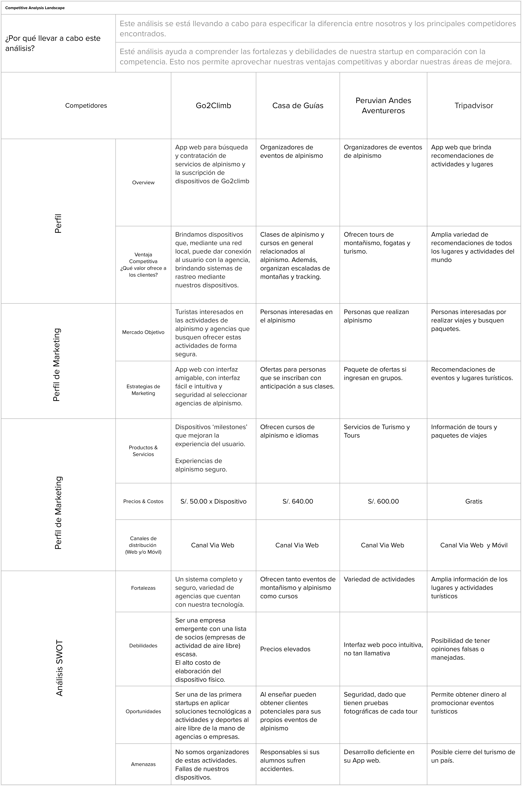
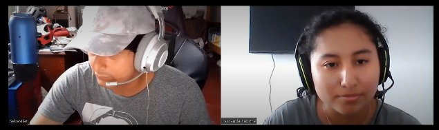
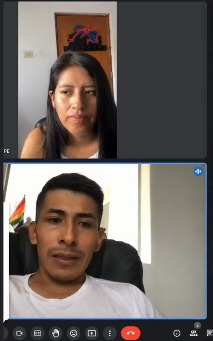
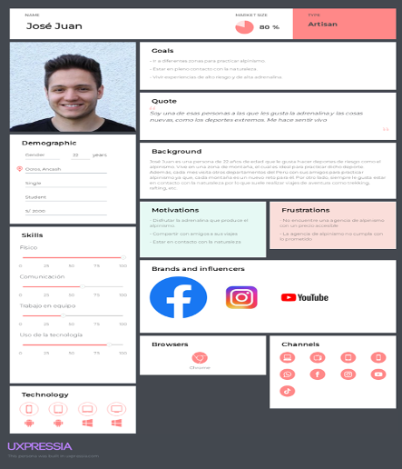
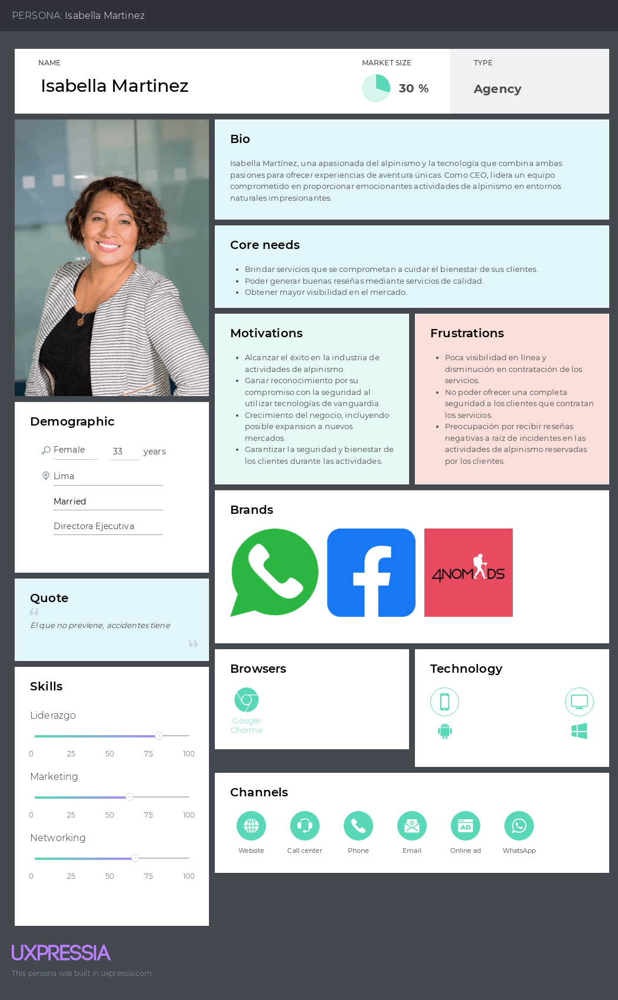
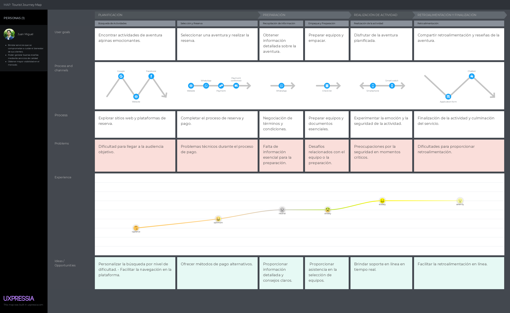
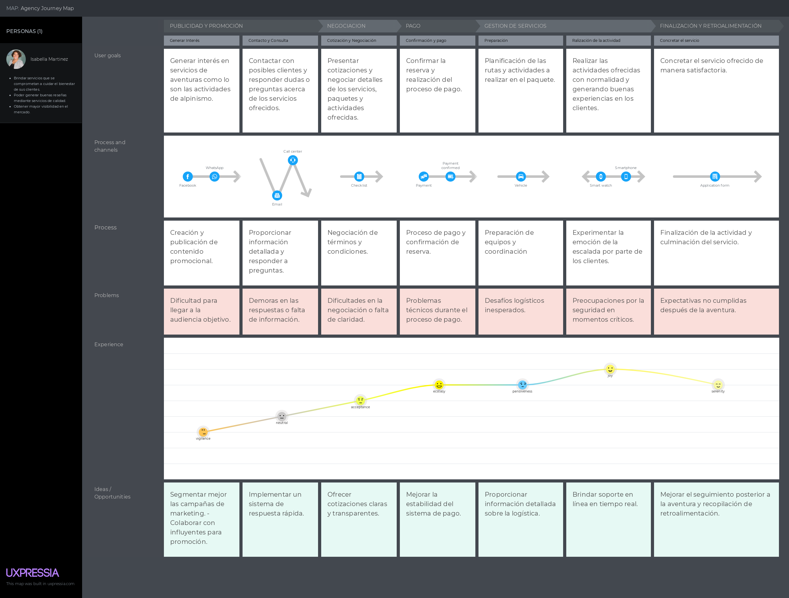
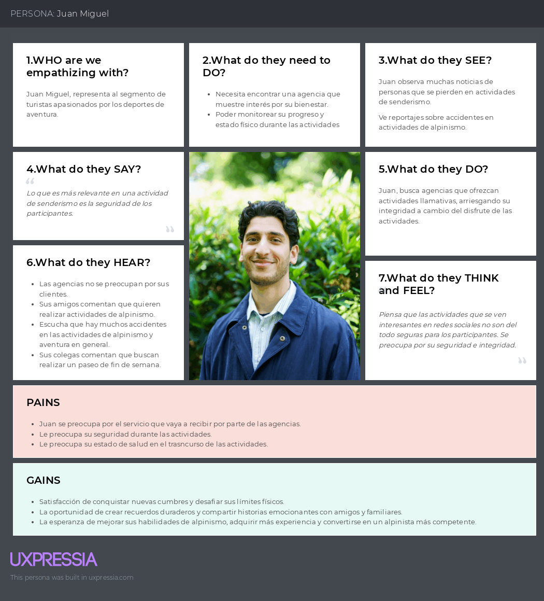
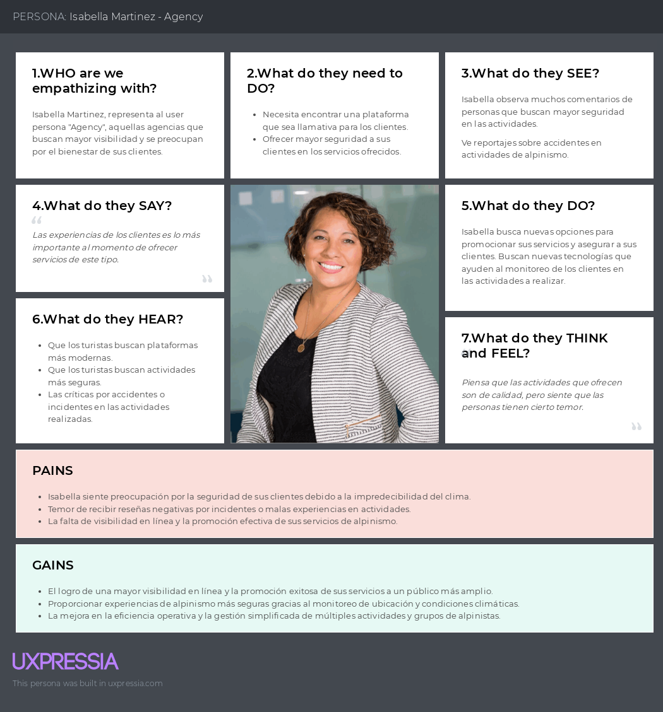
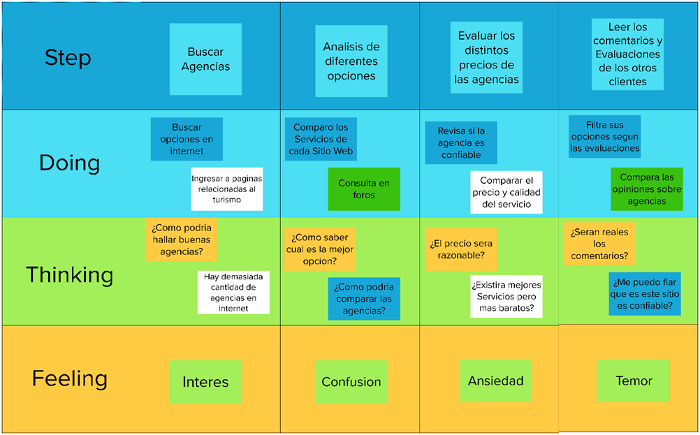

### Competidores

#### Análisis competitivo

Para el análisis competitivo, se tomaron en cuenta algunos de nuestros posibles competidores en el mercado, y se detallan algunas de nuestras fortalezas y debilidades de nuestros competidores.

 {.table-competitive}

#### Estrategias y tácticas frente a competidores

Al conocer los puntos puertos y débiles de nuestra competencia, tenemos clara nuestras estrategias a aplicar y las tácticas que usaremos.

Estrategia de diferenciación {.small-subtitle}

Nuestra aplicación ofrece la innovativa idea de ofrecer a los turistas de aventuras una serie de tours organizadas por las agencias de alpinismo. Del mismo modo, las agencias de alpinismo podrán tener otra vía en donde se puedan promocionar. Este modelo de negocio nos permite diferenciarnos de la competencia debido a que no nos centramos en un solo segmento objetivo, sino que, al juntar los turistas con las agencias, nos permitirá contar con un mejor posicionamiento del mercado.

Estrategia de enfoque {.small-subtitle}

Actualmente las personas utilizan mucho la tecnología para poder obtener información sobre algo que desean. Por ello, hemos decidido crear una aplicación para que en una sola página, puedan obtener todos los tours que se ofrecen y ellos sin mayor esfuerzo puedan decidir que tour obtener.

Táctica de expansión {.small-subtitle}

Si la aplicación logra tener mucho éxito, se planea no solo ofrecer tours de alpinismo, sino cualquier variedad de tours como city tour, eventos, entre otros. De esta manera, ampliamos nuestro segmento objetivo lo que conllevará a más clientes y un mejor posicionamiento en el mercado.

### Entrevistas

En esta sección se va a realizar las entrevistas a representantes de cada segmento objetivo para conocer el mercado que se está abordando. Para ello, se va a realizar el diseño de las entrevistas y luego un análisis de las respuestas de los entrevistados.

#### Diseño de entrevistas

**Preguntas principales y complementarias para entrevistas:**

Como parte del análisis needfinding del proyecto, un paso importante que hay que seguir es la realización de entrevistas a los segmentos objetivos para la captación de necesidades y oportunidad de enfatizar con ellos en busca de la creación de la mejor solución software.

A continuación, se presenta la línea de secuencias y la lista de preguntas a realizar a nuestros usuarios.

**Segmento de agencias:**

Bienvenida {.small-subtitle}

Hola buenas (días/tardes/noches), estoy trabajando en una idea de negocio que pretende ayudar a mejorar la experiencia de alpinismo en un ambiente mucho más social y conociendo personas qué también disfruten este deporte. Tenemos una serie de teorías respecto a los problemas que se enfrentan los turistas de aventura al momento de buscar empresas de alpinismo confiables y quisiera contrastarlas contigo para ver si estamos en lo cierto o no. Si te parece comenzaré con algunas preguntas a continuación y al finalizar te cuento de qué va el proyecto.

Datos demográficos {.small-subtitle}

¿Podrías contarnos un poco más de ti? (Un poco de tu historia, quien eres, tu edad, dónde vives, estudios, si es que trabajas actualmente, responsabilidades cotidianas, hobbies, etc.)

La Personas debe responder lo siguiente, de lo contrario preguntar sobre estos tópicos:

· Nombre

· Edad

· Distrito de residencia

· Estado civil

· Familia

· Ocupación

· Hobbies

Ahora a manera de dinámica, mencionaré algunas frases y responde como mejor creas conveniente (esta parte realizar como un tipo de ping pong de preguntas y respuestas):

· Programas de televisión de la infancia

· Programas de televisión de la actualidad

· Carro particular o transporte público

· Android o Apple

· Windows, Linux o Mac

· Aprendizaje guiado o autodidacta

· Ver una película o leer un libro

· Redes sociales más utilizadas

· Menciona 2 otras apps (diferente a redes sociales, pueden ser juegos de celular también) que utilices frecuentemente

· Plan telefónico prepago o postpago

· Banco preferido

Principales problemas {.medium-subtitle}

· ¿Cuánta experiencia tienes como guía en alpinismo?

· ¿Has utilizado servicios de publicidad para incrementar el flujo de clientes? ¿Qué servicios has utilizado? ¿Cuán efectivos han sido?

· ¿Qué medios utilizas para comunicarte con tus clientes? ¿Cuál es tu favorito?

· ¿Has tenido alguna mala experiencia con tus clientes cuando contratan tus servicios? ¿Cómo fue?

· ¿Cómo gestionas los pagos de tus servicios con tus clientes?

· ¿Qué crees que buscan los turistas cuando buscan contratar algún servicio de alpinismo?

· ¿Cuántas personas en promedio anual usan tu servicio?

· ¿Consideras que hay una comunidad grande de personas que realizan montañismo o alpinismo? (la respuesta será no así que.) ¿Cómo crees que se podría cambiar eso?

· ¿Qué crees que es lo que el cliente valora más del servicio?

· ¿Crees que publicándolos en una plataforma enfocada en montañismo aumentaría o disminuiría el alcance que tienes actualmente? ¿Por qué?

**Breve Pitch:**

Estamos desarrollando una plataforma web enfocada en ofrecer servicios de alpinismo. Las empresas podrán publicitarse en la plataforma, junto con los precios, rutas, itinerarios, horarios y experiencias. Asimismo, los turistas podrán seleccionar la empresa de su preferencia, reaccionar a las experiencias y calificar a la empresa.

Compromiso {.medium-subtitle}

¿Qué te ha parecido? ¿Tienes alguna recomendación para nosotros?

Gracias por habernos concedido esta entrevista, tus respuestas son valiosas para nosotros

Como último punto, nos gustaría pedirte una reunión otra vez de aquí a unas cuantas semanas, donde te podremos mostrarte cómo va el desarrollo de nuestra idea, donde podremos mostrarte el prototipo de nuestra aplicación y obtener retroalimentación de ti una vez más.

#### Registro de entrevistas

##### Entrevista N°1

<!--Change data for each person-->

- Nombre: Sebastián Andre Ramírez Mendez
- Edad: 21 años
- Residencia: La Victoria
- Segmento Objetivo: Turista
- Enlace de entrevista: <https://upcedupe-my.sharepoint.com/:v:/g/personal/u202019558_upc_edu_pe/EQDSsRoZXKdLnU-CJaI48tgBhFsyfjmsRPfc0RNNViLXjA?e=f0a72b>.
- Timing: 00:00
- Duración: 06:25 minutos
- Resumen: Sebastián, un aventurero amante de los deportes extremos, compartió su deseo de utilizar tecnología avanzada para mejorar su seguridad y experiencia mientras realiza actividades alpinas. Busca dispositivos y herramientas que le proporcionen datos en tiempo real sobre su ubicación y salud, así como alertas de seguridad. Además, destacó la importancia de mantenerse conectado durante sus aventuras.

##### Entrevista N°2

<!--Change data for each person-->

- Nombre: Nilda Sharol Flores Ramirez
- Edad: 23 años
- Residencia: Mozambique
- Segmento Objetivo: La Breña
- Enlace de entrevista: <https://upcedupe-my.sharepoint.com/:v:/g/personal/u202019558_upc_edu_pe/EQDSsRoZXKdLnU-CJaI48tgBhFsyfjmsRPfc0RNNViLXjA?e=f0a72b>.
- Timing: 06:26
- Duración: 04:25 minutos
- Resumen: Durante la conversación con Nilda, una entusiasta de actividades al aire libre, se resaltó su necesidad de encontrar y reservar servicios de alpinismo de manera sencilla y segura. Valoró la conveniencia de tener acceso a información detallada sobre las rutas y el clima antes de comprometerse con una actividad. María también mencionó que las reseñas de otros usuarios son fundamentales para tomar decisiones informadas.

Análisis General: Ambas entrevistas resaltaron la relevancia de la seguridad, la conveniencia y la tecnología en la experiencia de los turistas que participan en actividades alpinas. Los usuarios como

#### Análisis de entrevistas

<!-- TODO: Improve when we have more interviews -->

En esta sección se realizará el análisis de las entrevistas aplicadas a nuestros segmentos objetivos.

<!-- TODO: Add a summary of the most relevant information obtained from the users during the interview-->

Ambas entrevistas resaltaron la relevancia de la seguridad, la conveniencia y la tecnología en la experiencia de los turistas que participan en actividades alpinas. Los usuarios como Nilda buscan una plataforma fácil de usar para encontrar y reservar servicios, mientras que usuarios como Sebastian valoran dispositivos y funcionalidades tecnológicas que les brinden seguridad y datos en tiempo real. Las reseñas de otros usuarios también juegan un papel esencial en la toma de decisiones. Estos insights serán fundamentales para el desarrollo de Go2Climb y la satisfacción de las necesidades de sus usuarios.

### Needfinding

#### User Personas

Los user personas nos permite recopilar las principales características de cada segmento objetivo representados en una persona. En este caso, la información se recopiló de las entrevistas realizadas en las secciones previas.

##### Tourist

El user persona 'Tourist' representa a los aventureros apasionados por el alpinismo que buscan experiencias emocionantes en la montaña. Conocer sus expectativas y desafíos nos ayuda a diseñar una aplicación que enriquezca sus aventuras alpinas y garantice su seguridad.

 {.user-persona-img}

##### Agency

El user persona 'Agency' representa a las agencias especializadas en actividades de alpinismo que buscan proporcionar aventuras seguras y emocionantes a sus clientes. Comprender sus necesidades es fundamental para ofrecer soluciones efectivas que les permitan garantizar la seguridad de sus clientes en las montañas.

 {.user-persona-img}

#### User Task Matrix

Se desarrolló el User Task Matrix para identificar y priorizar las tareas del usuario en función de su frecuencia y importancia, lo que permitirá mejorar la experiencia del usuario y la eficacia del producto PlantGuard, con el fin de elaborar un adecuado User Task Matrix se toma como referencia a los segmentos objetivos identificados, y el análisis de nuestras entrevistas realizadas.

#### User Journey Mapping

Esta herramienta es esencial para comprender en detalle cómo interactúan nuestros usuarios con nuestra aplicación a lo largo de su experiencia. Esta sección nos permite analizar paso a paso el viaje de cada user persona, desde la etapa de descubrimiento hasta la finalización de sus objetivos. Al comprender sus puntos de contacto, emociones y desafíos a lo largo de este viaje, podemos mejorar continuamente nuestra aplicación para brindar experiencias más satisfactorias y efectivas

##### Tourist

Nos sumerge en las experiencias de los turistas aventureros que utilizan nuestra aplicación. Seguimos sus pasos desde la búsqueda de aventuras hasta el monitoreo de su ubicación en tiempo real durante la escalada. Esta visualización detallada nos permite adaptar nuestra aplicación para que coincida con sus expectativas y necesidades, garantizando aventuras inolvidables y seguras.

##### Agency

Permite explorar en profundidad cómo una agencia utiliza nuestra aplicación para garantizar la seguridad de sus clientes. Desde la planificación de rutas hasta la implementación de dispositivos de monitoreo, seguimos el viaje de esta agencia mientras trabaja con nuestra tecnología para brindar aventuras emocionantes y seguras

#### Empathy Mapping

Esta herramienta nos permitió entender mejor a nuestro sector objetivo, pues nos permite ver el mundo a través de su perspectiva.

##### Tourist

El Empathy Mapping para el segmento "Tourist" es una herramienta de investigación que nos ayuda a comprender profundamente a los turistas que potencialmente utilizarán nuestra plataforma o servicios. Este mapa de empatía se centra en capturar las percepciones, necesidades, pensamientos y emociones de los turistas antes de que utilicen nuestra aplicación o servicios. Al comprender sus puntos de vista y motivaciones, podemos diseñar experiencias que satisfagan sus expectativas y faciliten su viaje.

A continuación, desglosamos las principales áreas que exploramos en nuestro Empathy Mapping para los turistas:

##### Agency

El Empathy Mapping para el segmento "Agency" es una herramienta que nos ayuda a comprender a fondo las perspectivas, motivaciones y consideraciones de las agencias que utilizan nuestra plataforma o servicios. A través de este mapa de empatía, capturamos información clave sobre lo que las agencias desean lograr y cómo interactúan con nuestros servicios antes de comenzar a utilizarlos. Esto nos permite diseñar una experiencia que respalde sus objetivos comerciales y mejore su satisfacción.

A continuación, desglosamos las áreas principales que exploramos en nuestro Empathy Mapping para las agencias:

#### As-is Scenario Mapping

##### Tourist

El AS-IS Scenario Mapping para el segmento "Tourist" representa visualmente la situación actual de los turistas antes de que interactúen con nuestra plataforma o servicios. Este mapa nos ayuda a comprender su situación, necesidades, comportamientos y desafíos antes de considerar nuestra oferta. Al obtener una visión clara de su estado actual, podemos diseñar soluciones que aborden sus preocupaciones y optimicen su experiencia desde el principio.

##### Agency

El AS-IS Scenario Mapping para el segmento "Agency" representa visualmente la situación actual de las agencias antes de que interactúen con nuestra plataforma o servicios. Este mapa nos ayuda a comprender su situación, necesidades, comportamientos y desafíos antes de considerar nuestra oferta. Al obtener una visión clara de su estado actual, podemos diseñar soluciones que aborden sus preocupaciones y optimicen su experiencia desde el principio.

