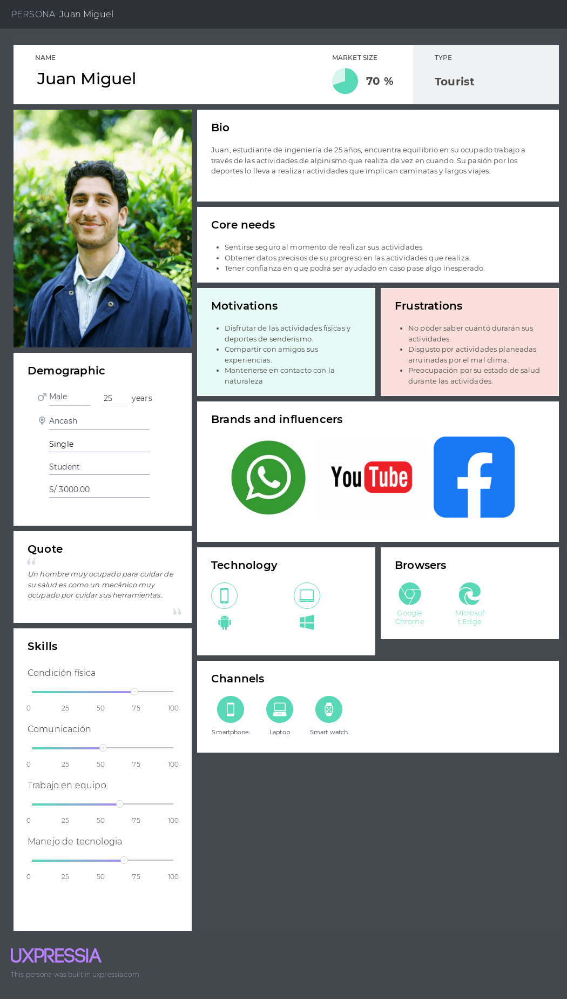
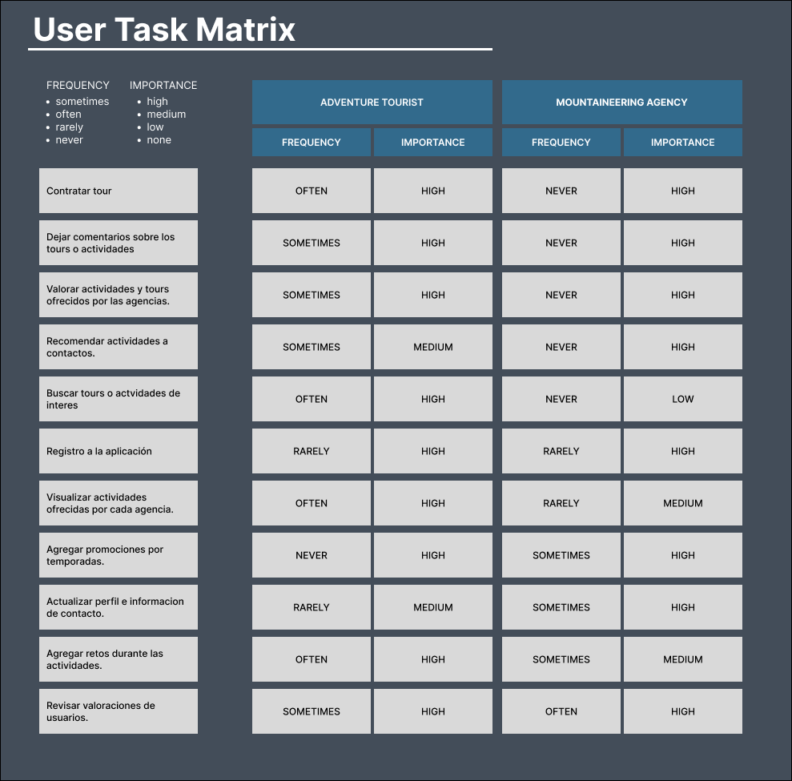

### Competidores

#### Análisis competitivo

Para el análisis competitivo, se tomaron en cuenta algunos de nuestros posibles competidores en el mercado, y se detallan algunas de nuestras fortalezas y debilidades de nuestros competidores.

 {.table-competitive}

#### Estrategias y tácticas frente a competidores

Al conocer los puntos puertos y débiles de nuestra competencia, tenemos clara nuestras estrategias a aplicar y las tácticas que usaremos.

Estrategia de diferenciación {.small-subtitle}

Nuestra aplicación ofrece la innovativa idea de ofrecer a los turistas de aventuras una serie de tours organizadas por las agencias de alpinismo. Del mismo modo, las agencias de alpinismo podrán tener otra vía en donde se puedan promocionar. Este modelo de negocio nos permite diferenciarnos de la competencia debido a que no nos centramos en un solo segmento objetivo, sino que, al juntar los turistas con las agencias, nos permitirá contar con un mejor posicionamiento del mercado.

Estrategia de enfoque {.small-subtitle}

Actualmente las personas utilizan mucho la tecnología para poder obtener información sobre algo que desean. Por ello, hemos decidido crear una aplicación para que en una sola página, puedan obtener todos los tours que se ofrecen y ellos sin mayor esfuerzo puedan decidir que tour obtener.

Táctica de expansión {.small-subtitle}

Si la aplicación logra tener mucho éxito, se planea no solo ofrecer tours de alpinismo, sino cualquier variedad de tours como city tour, eventos, entre otros. De esta manera, ampliamos nuestro segmento objetivo lo que conllevará a más clientes y un mejor posicionamiento en el mercado.

### Entrevistas

En esta sección se va a realizar las entrevistas a representantes de cada segmento objetivo para conocer el mercado que se está abordando. Para ello, se va a realizar el diseño de las entrevistas y luego un análisis de las respuestas de los entrevistados.

#### Diseño de entrevistas

**Preguntas principales y complementarias para entrevistas:**

Como parte del análisis needfinding del proyecto, un paso importante que hay que seguir es la realización de entrevistas a los segmentos objetivos para la captación de necesidades y oportunidad de enfatizar con ellos en busca de la creación de la mejor solución software.

A continuación, se presenta la línea de secuencias y la lista de preguntas a realizar a nuestros usuarios.

**Segmento de agencias:**

Bienvenida {.small-subtitle}

Hola buenas (días/tardes/noches), estoy trabajando en una idea de negocio que pretende ayudar a mejorar la experiencia de alpinismo en un ambiente mucho más social y conociendo personas qué también disfruten este deporte. Tenemos una serie de teorías respecto a los problemas que se enfrentan los turistas de aventura al momento de buscar empresas de alpinismo confiables y quisiera contrastarlas contigo para ver si estamos en lo cierto o no. Si te parece comenzaré con algunas preguntas a continuación y al finalizar te cuento de qué va el proyecto.

Datos demográficos {.small-subtitle}

¿Podrías contarnos un poco más de ti? (Un poco de tu historia, quien eres, tu edad, dónde vives, estudios, si es que trabajas actualmente, responsabilidades cotidianas, hobbies, etc.)

La Personas debe responder lo siguiente, de lo contrario preguntar sobre estos tópicos:

· Nombre

· Edad

· Distrito de residencia

· Estado civil

· Familia

· Ocupación

· Hobbies

Ahora a manera de dinámica, mencionaré algunas frases y responde como mejor creas conveniente (esta parte realizar como un tipo de ping pong de preguntas y respuestas):

· Programas de televisión de la infancia

· Programas de televisión de la actualidad

· Carro particular o transporte público

· Android o Apple

· Windows, Linux o Mac

· Aprendizaje guiado o autodidacta

· Ver una película o leer un libro

· Redes sociales más utilizadas

· Menciona 2 otras apps (diferente a redes sociales, pueden ser juegos de celular también) que utilices frecuentemente

· Plan telefónico prepago o postpago

· Banco preferido

Principales problemas {.medium-subtitle}

· ¿Cuánta experiencia tienes como guía en alpinismo?

· ¿Has utilizado servicios de publicidad para incrementar el flujo de clientes? ¿Qué servicios has utilizado? ¿Cuán efectivos han sido?

· ¿Qué medios utilizas para comunicarte con tus clientes? ¿Cuál es tu favorito?

· ¿Has tenido alguna mala experiencia con tus clientes cuando contratan tus servicios? ¿Cómo fue?

· ¿Cómo gestionas los pagos de tus servicios con tus clientes?

· ¿Qué crees que buscan los turistas cuando buscan contratar algún servicio de alpinismo?

· ¿Cuántas personas en promedio anual usan tu servicio?

· ¿Consideras que hay una comunidad grande de personas que realizan montañismo o alpinismo? (la respuesta será no así que.) ¿Cómo crees que se podría cambiar eso?

· ¿Qué crees que es lo que el cliente valora más del servicio?

· ¿Crees que publicándolos en una plataforma enfocada en montañismo aumentaría o disminuiría el alcance que tienes actualmente? ¿Por qué?

**Breve Pitch:**

Estamos desarrollando una plataforma web enfocada en ofrecer servicios de alpinismo. Las empresas podrán publicitarse en la plataforma, junto con los precios, rutas, itinerarios, horarios y experiencias. Asimismo, los turistas podrán seleccionar la empresa de su preferencia, reaccionar a las experiencias y calificar a la empresa.

Compromiso {.medium-subtitle}

¿Qué te ha parecido? ¿Tienes alguna recomendación para nosotros?

Gracias por habernos concedido esta entrevista, tus respuestas son valiosas para nosotros

Como último punto, nos gustaría pedirte una reunión otra vez de aquí a unas cuantas semanas, donde te podremos mostrarte cómo va el desarrollo de nuestra idea, donde podremos mostrarte el prototipo de nuestra aplicación y obtener retroalimentación de ti una vez más.

#### Registro de entrevistas

##### Entrevista N°1

<!--Change data for each person-->

- Nombre: Leonard
- Edad: 67 años
- Residencia: Mozambique
- Segmento Objetivo: Turista
- Enlace de entrevista: <InterviewLink>.
- Resumen: Nulla cillum duis esse et consequat nisi in sint cupidatat incididunt elit proident in minim. Non adipisicing minim consectetur sint cupidatat laboris incididunt tempor culpa. Nisi culpa Lorem sunt nostrud in duis reprehenderit do sunt laborum qui.

#### Análisis de entrevistas

<!-- TODO: Improve when we have more interviews -->

En esta sección se realizará el análisis de las entrevistas aplicadas a nuestros segmentos objetivos.

<!-- TODO: Add a summary of the most relevant information obtained from the users during the interview-->

Do amet mollit cillum laborum id exercitation commodo aute qui ad et consectetur est. Magna minim culpa deserunt aliquip anim ullamco. Quis cillum et ut mollit veniam aliquip. Deserunt tempor exercitation est culpa anim aliquip. Nulla aute in adipisicing ipsum culpa exercitation cupidatat magna non quis irure do laborum.

### Needfinding

#### User Personas

Los user personas nos permite recopilar las principales características de cada segmento objetivo representados en una persona. En este caso, la información se recopiló de las entrevistas realizadas en las secciones previas.

##### Tourist

##### Agency

#### User Task Matrix

Se desarrolló el User Task Matrix para identificar y priorizar las tareas del usuario en función de su frecuencia y importancia, lo que permitirá mejorar la experiencia del usuario y la eficacia del producto PlantGuard, con el fin de elaborar un adecuado User Task Matrix se toma como referencia a los segmentos objetivos identificados, y el análisis de nuestras entrevistas realizadas.

#### Empathy Mapping

Esta herramienta nos permitió entender mejor a nuestro sector objetivo, pues nos permite ver el mundo a través de su perspectiva.

##### Tourist

##### Agency

#### As-is Scenario Mapping

##### Tourist

##### Agency

