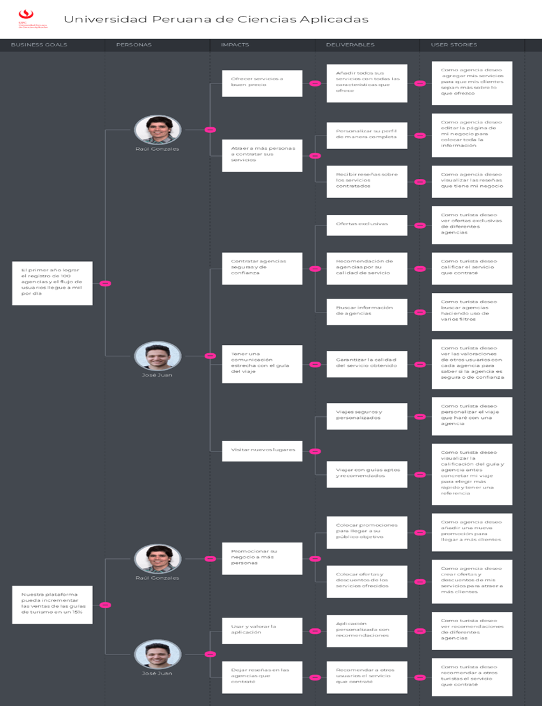

### To-Be Scenario Mapping

#### User Tourist

En el proceso de diseño y desarrollo de nuestro proyecto, hemos creado un diagrama To-be Scenario mapping que representa la experiencia del usuario para el segmento "Tourists". Este diagrama ilustra las etapas clave en el proceso de reserva de actividades de alpinismo, desde la reserva de sus paquetes, hasta la interacción con nuestros servicios. A continuación, presentamos una representación visual de este escenario mejorado que nos ayuda a comprender mejor las necesidades y expectativas de nuestros usuarios.

#### User Agency

Hemos desarrollado un diagrama To-be Scenario mapping que representa la experiencia del usuario para el segmento "Agency". Este diagrama refleja las acciones clave que un representante de una agencia puede llevar a cabo en nuestra aplicación web. Aquí se describen los pasos fundamentales en la interacción de una agencia con nuestra plataforma:

### User Stories

!include (../partials/user-stories-table.html)

### Impact Mapping

El Impact Mapping nos ayuda a comprender y visualizar cómo los objetivos de alto nivel de nuestra startup, como empoderar a los amantes de los deportes al aire libre, pueden desglosarse en resultados concretos. A través de un análisis detallado, identificaremos los actores clave que pueden contribuir o verse afectados por nuestro proyecto, definiremos los comportamientos que deseamos cambiar y, lo más importante, determinaremos las soluciones que ofreceremos para lograr un impacto positivo en la comunidad de deportes al aire libre

### Product Backlog

Cada elemento en el backlog representa una oportunidad para mejorar la experiencia de los turistas y las agencias de alpinismo que utilizan la plataforma. Estas funcionalidades están diseñadas para hacer que la búsqueda, reserva y planificación de actividades al aire libre sea más fácil y eficiente.

!include (../partials/product-backlog-table.html)
