### Strategic-Level Domain-Driven-Design

#### EventStorming

El equipo colaboró efectivamente para explorar y definir las principales ideas que conforman el proceso de creación del EventStorming. Primero, nos organizamos para recapitular los principales procesos y eventos que ocurren en nuestro sistema, es así que fuimos realizando el procesos del event storming, el cual se muestra a continuación:

##### Candidate Context Discovery

En este apartado, identificamos mediante la técnica de start-with-value los contextos candidatos al profundo análisis de su funcionamiento. Esto debido a que representan la lógica principal del modelo de negocio. Se definen de manera precisa cada etapa del proceso que buscamos que los usuarios sigan al usar nuestro sistema. Estos bounded context son los que conforman nuestro sistema.

##### Domain Message Flows Modeling

En este apartado, evidenciamos el correcto flujo de procesos ocurridos durante el uso de nuestro sistema, la interconexión e interacción entre los bounded contexts planteados y los elementos que los conforman para cumplir con el escenario ideal planteado.

##### Bounded Context Canvases

De igual manera que en las secciones previas, definimos los canvases de los bounded contexts más relevantes en nuestro sistema. En estos, describimos a profundidad el contenido establecido en el Event Storming.

#### Context Mapping

El diagrama de implementación se enfoca en la infraestructura subyacente que respalda nuestro sistema. Muestra cómo se despliegan nuestros contenedores y componentes en servidores, máquinas virtuales o en la nube, lo que ayuda a visualizar la configuración física de nuestra arquitectura.

#### Software Architecture

En nuestro proyecto, hemos utilizado el enfoque del modelo C4 para representar de manera efectiva la arquitectura de nuestro sistema. Cada uno de los siguientes diagramas desglosa diferentes aspectos de nuestro sistema, desde una vista de alto nivel hasta detalles de implementación. A continuación, presentamos una breve descripción de cada uno de ellos.

##### Software Architecture System Landscape Diagram

Este diagrama proporciona una vista panorámica de nuestro sistema en su contexto más amplio. Muestra las relaciones de alto nivel entre los diferentes sistemas y componentes que forman parte de nuestra arquitectura, ayudando a comprender cómo se conecta nuestro sistema con otros sistemas externos y partes interesadas.

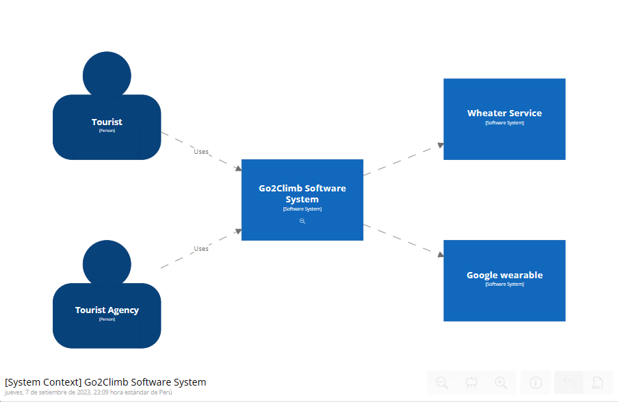

##### Software Architecture Context Level Diagrams

Este diagrama se centra en nuestro sistema y sus interacciones con actores externos, como usuarios, sistemas externos u otras partes interesadas. Proporciona una visión general de alto nivel de las principales funcionalidades y componentes de nuestro sistema y cómo se relacionan con su entorno.

##### Software Architecture Container Level Diagrams

En este diagrama, nos sumergimos un poco más en la arquitectura interna de nuestro sistema. Mostramos los principales contenedores y componentes que componen nuestro sistema, así como las relaciones y dependencias entre ellos. Este diagrama proporciona una comprensión detallada de cómo se estructura y organiza nuestro sistema.

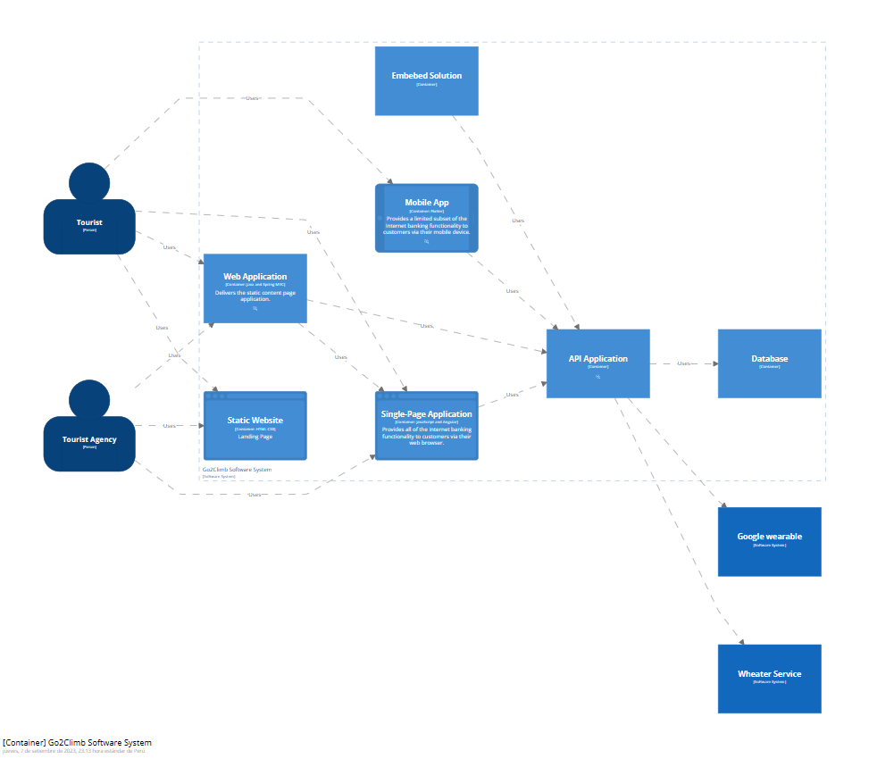

##### Software Architecture Deployment Diagrams

El diagrama de implementación se enfoca en la infraestructura subyacente que respalda nuestro sistema. Muestra cómo se despliegan nuestros contenedores y componentes en servidores, máquinas virtuales o en la nube, lo que ayuda a visualizar la configuración física de nuestra arquitectura.

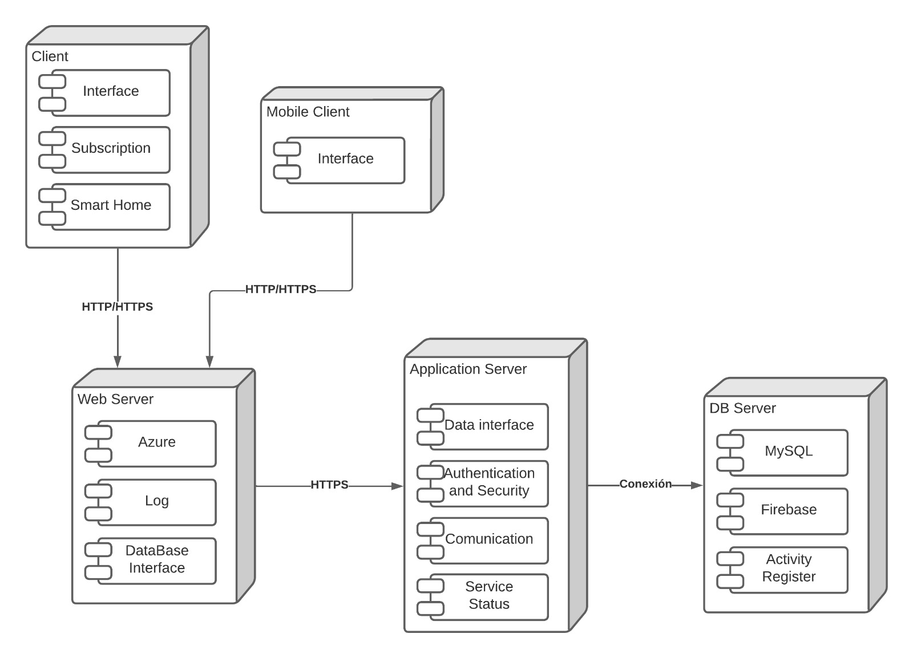

### Tactical-Level Domain-Driven Design

#### Bounded Context Account Management

En el contexto de "Account Management", este diseño se centra en la gestión de la creación de cuentas para agencias y las interacciones relacionadas con una página web. Incluye la modelización de dominio, servicios de aplicación y componentes de infraestructura para cumplir con los requisitos de creación de cuentas de agencia, registro y operaciones específicas de la agencia. La arquitectura también considera servicios externos, como servicios de terceros, que pueden estar involucrados en el proceso de creación de cuentas.

##### Domain Layer

**Objetos de Dominio:** Modelos que representan conceptos relacionados con la agencia (por ejemplo, Agencia, Cuenta). 
**Servicios de Dominio:** Servicios para manejar la creación de cuentas y operaciones relacionadas con la agencia. 
**Agregados:** Agregados para gestionar la creación de cuentas dentro del contexto de la agencia.

##### Interface Layer

**Página Web:** La interfaz de usuario para interactuar con la agencia y crear una cuenta. 
**API de Registro:** Una API o interfaz para manejar las solicitudes de registro desde la página web.

##### Application Layer

**Servicio de Aplicación de Registro:** Un servicio responsable de coordinar el proceso de registro. 
**Servicio de Aplicación de Agencia:** Un servicio que maneja operaciones específicas de la agencia. 
**Servicio de Aplicación de Creación de Cuentas:** Un servicio que gestiona la creación de cuentas.

##### Infraestructure Layer

**Base de Datos:** La base de datos utilizada para almacenar información de la agencia y las cuentas. 
**Sistemas Externos:** Cualquier sistema o servicio externo necesario para cumplir con las necesidades de la agencia (por ejemplo, servicios de terceros para la creación de cuentas).

##### Bounded Context Account Management Software Architecture Component Level Diagrams

<!--Add Component Level Diagrams-->

##### Bounded Context Account Management Software Architecture Code Level Diagrams

###### Bounded Context Account Management Domain Layer Class Diagrams

Este diagrama de clases representa el modelo de dominio para la gestión de cuentas de usuario y la seguridad en el contexto "Account Management". Incluye clases que abarcan usuarios, perfiles, roles, sesiones y otras entidades clave. Las relaciones entre estas clases reflejan la interacción entre los diversos componentes del sistema para garantizar una gestión eficiente y segura de las cuentas de usuario.

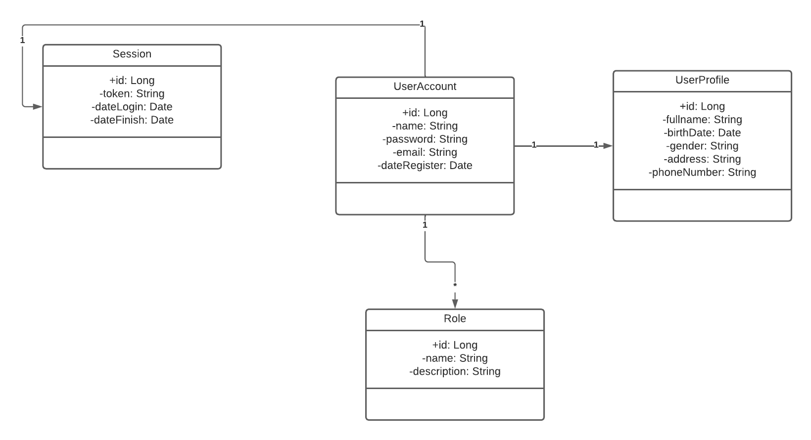

###### Bounded Context Account Management Database Design Diagram

Este diagrama de base de datos proporciona una vista estructurada de cómo se almacenan los datos relacionados con la gestión de cuentas de usuario. Define las tablas, sus atributos y las relaciones entre ellas. Esto facilita el acceso y la administración de información crítica, como datos de usuario, perfiles, roles, sesiones en un entorno seguro y eficiente.

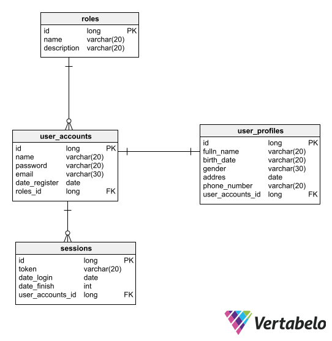

#### Bounded Context Experience Design

En el contexto de "Experience Design", este diseño se enfoca en proporcionar una experiencia de usuario mejorada a través de la generación de informes de rendimiento y alertas de seguridad. Incluye la modelización de dominio, servicios de aplicación y componentes de infraestructura para cumplir con los requisitos de generación de informes, alertas de seguridad y coordinación de servicios de rescate en respuesta a alertas de seguridad. La arquitectura también considera la interacción con dispositivos IoT para recopilar datos de temperatura y altitud que pueden mejorar la experiencia del usuario.

##### Domain Layer

**Objetos de Dominio:** Modelos que representan conceptos relacionados con la experiencia de usuario (por ejemplo, Usuario, Informe de Rendimiento, Alerta de Seguridad). 
**Servicios de Dominio:** Servicios para gestionar la generación de informes de rendimiento y alertas de seguridad. 
**Agregados:** Servicios para gestionar la generación de informes de rendimiento y alertas de seguridad

##### Interface Layer

**Aplicación Móvil:** La aplicación móvil utilizada por los usuarios para acceder a la experiencia de usuario. 
**Dispositivos IoT:** Dispositivos IoT que leen datos de temperatura y altitud para mejorar la experiencia del usuario. 
**API de Generación de Informes:** Una API que maneja la generación de informes de rendimiento. API de Alerta de Seguridad: Una API que maneja las alertas de seguridad.

##### Application Layer

**Servicio de Generación de Informes:** Un servicio responsable de generar informes de rendimiento para el usuario.  
**Servicio de Alerta de Seguridad:** Un servicio que envía alertas de seguridad a los usuarios y a los servicios de rescate. 
**Servicio de Rescate:** Un servicio que gestiona las alertas de seguridad y coordina la respuesta de los servicios de rescate.

##### Infraestructure Layer

**Base de Datos:** La base de datos utilizada para almacenar informes de rendimiento y datos relacionados con alertas de seguridad.

##### Bounded Context Experience Design Software Architecture Component Level Diagrams

<!--Add Component Level Diagrams-->

##### Bounded Context Experience Design Software Architecture Code Level Diagrams

###### Bounded Context Experience Design Domain Layer Class Diagrams

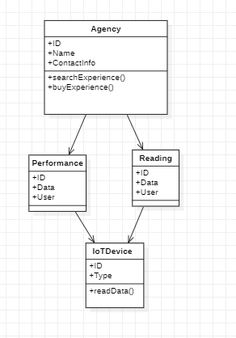

###### Bounded Context Experience Design Database Design Diagram

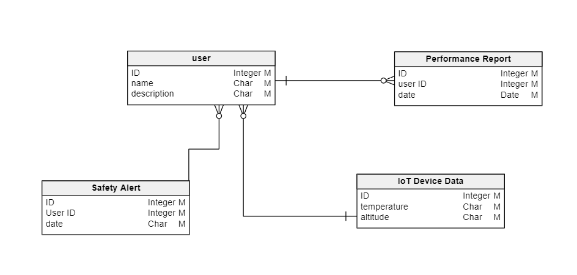

#### Bounded Context Service Process

En el contexto de "Service Process", este diseño se enfoca en la gestión del proceso de servicio, desde la selección de servicios por parte del usuario hasta el procesamiento de pagos y la actualización del inventario. Incluye la modelización de dominio, servicios de aplicación y componentes de infraestructura necesarios para llevar a cabo estas operaciones. También considera la interacción con sistemas externos, como el sistema de inventario y la notificación a la agencia correspondiente cuando se presta un servicio.

##### Domain Layer

**Objetos de Dominio:** Modelos que representan conceptos relacionados con el proceso de servicio (por ejemplo, Dirección, Inventario, Tipo de Servicio). 
**Servicios de Dominio:** Servicios para gestionar la selección de servicios, el cálculo del tipo de servicio y la actualización del inventario. 

##### Interface Layer

**Interfaz de Usuario:** La interfaz de usuario utilizada por los usuarios para seleccionar servicios y proporcionar información de envío.

##### Application Layer

**Servicio de Procesamiento de Pagos:** Un servicio que maneja el procesamiento de pagos, incluyendo el uso de tarjetas de crédito (Visa, MC, American Express). 
**Servicio de Cumplimiento de Servicios:** Un servicio que gestiona el cumplimiento de los servicios seleccionados y notifica a la agencia correspondiente. 

##### Infraestructure Layer

**Sistema de Inventario:** El sistema utilizado para gestionar el inventario y actualizarlo cuando se presta un servicio.

##### Bounded Context Service Process Software Architecture Component Level Diagrams

<!--Add Component Level Diagrams-->

##### Bounded Context Service Process Software Architecture Code Level Diagrams

###### Bounded Context Service Process Domain Layer Class Diagrams

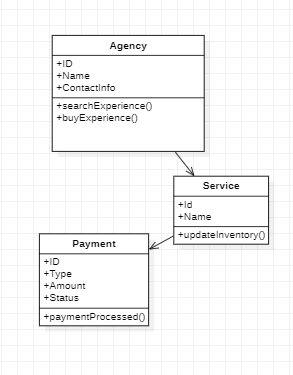

###### Bounded Context Service Process Database Design Diagram

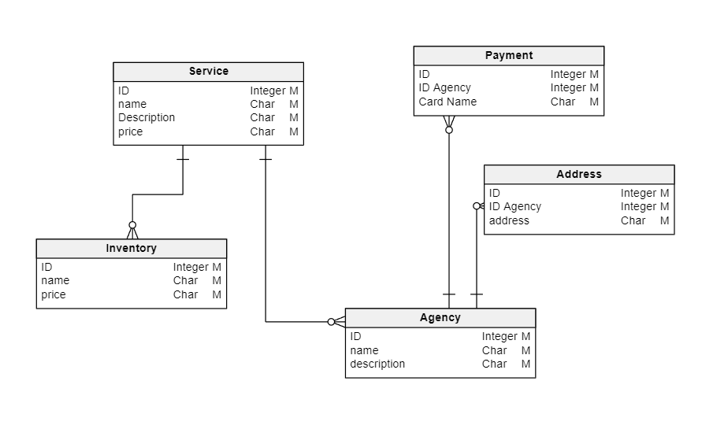

#### Bounded Context Security

En el contexto de "Security", este diseño se centra en proporcionar seguridad a los alpinistas, incluyendo el monitoreo de datos de seguridad, la generación de alertas y la presentación de información relevante a alpinistas y agencias. El agregado Datos de Seguridad se encarga de gestionar el monitoreo del pulso cardiaco y las condiciones climáticas, mientras que los servicios de aplicación procesan los datos y generan alertas cuando se detectan condiciones preocupantes. La infraestructura incluye una base de datos para almacenar los datos de seguridad y las alertas generadas.

##### Domain Layer

**Objetos de Dominio:** Objetos de Dominio: Modelos que representan conceptos relacionados con la seguridad (por ejemplo, Datos de Seguridad, Alerta de Seguridad). 
**Servicios de Dominio:** Servicios para procesar datos de seguridad, eventos relacionados con la seguridad y generar alertas de seguridad. 
**Agregados:** El agregado Datos de Seguridad que gestiona el monitoreo del pulso cardiaco y las condiciones climáticas.

##### Interface Layer

**Interfaz para Alpinistas:** Proporciona información sobre el pulso cardiaco y condiciones climáticas a alpinistas y agencias.

##### Application Layer

**Servicio de Procesamiento de Datos de Seguridad:** Un servicio que procesa datos de seguridad y eventos relacionados con la seguridad. 
**Servicio de Monitoreo de Seguridad:** Un servicio que monitorea los datos de seguridad de los alpinistas. 
**Generador de Alertas de Seguridad:** Un servicio que genera alertas de seguridad cuando se detectan condiciones preocupantes.

##### Infraestructure Layer

**Base de Datos de Seguridad:** Almacena los datos de seguridad y las alertas generadas.

##### Bounded Context Software Architecture Component Level Diagrams

<!--Add Component Level Diagrams-->

##### Bounded Context Security Software Architecture Code Level Diagrams

###### Bounded Context Security Domain Layer Class Diagrams

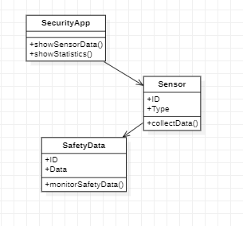

###### Bounded Context Security Database Design Diagram

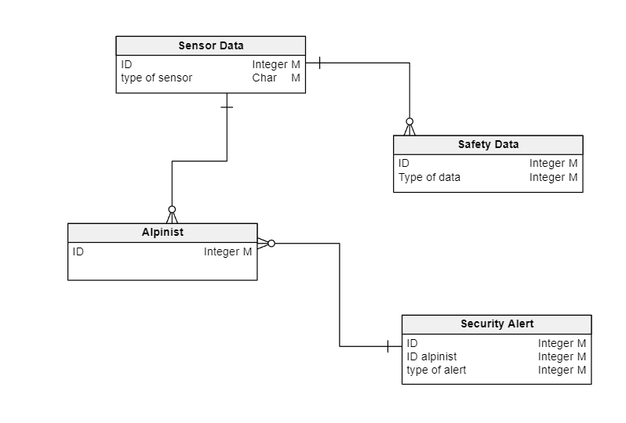

#### Bounded IoT Management

En el contexto de "Alquiler por suscripcion de Sensores y Relojes Inteligentes (Web)", este diseño se enfoca en la venta de sensores y relojes inteligentes a través de la web, incluyendo la interacción con proveedores, el procesamiento de comandos de compra de la subscripcion y la gestión del inventario y el estado de alquiler de dispositivos. El agregado Dispositivos se encarga de gestionar la información sobre los dispositivos disponibles y su estado, mientras que los servicios de aplicación procesan comandos de la suscripcion y generan eventos para registrar las ventas. La infraestructura incluye una base de datos para almacenar información relacionada con dispositivos y ventas.

##### Domain Layer

**Objetos de Dominio:** Objetos de Dominio: Modelos que representan conceptos relacionados con la venta de sensores y relojes inteligentes (por ejemplo, Dispositivos, Venta de Dispositivos). 
**Servicios de Dominio:** Servicios para procesar comandos de compra de dispositivos y crear eventos de venta. 
**Agregados:** El agregado Dispositivos que gestiona el inventario y el estado de compra de dispositivos.

##### Interface Layer

**Interacción con Proveedores:** Facilita la interacción con proveedores de dispositivos para adquirir sensores y relojes inteligentes.

##### Application Layer

**Servicio de Procesamiento de Comandos de Compra:** Un servicio que procesa comandos para comprar dispositivos.  
**Generador de Eventos de Venta:** Un servicio que crea eventos para registrar las ventas de dispositivos.

##### Infraestructure Layer

**Base de Datos de Dispositivos:** Almacena información sobre el inventario y el estado de compra de dispositivos.

##### Bounded Context IoT Management Software Architecture Component Level Diagrams

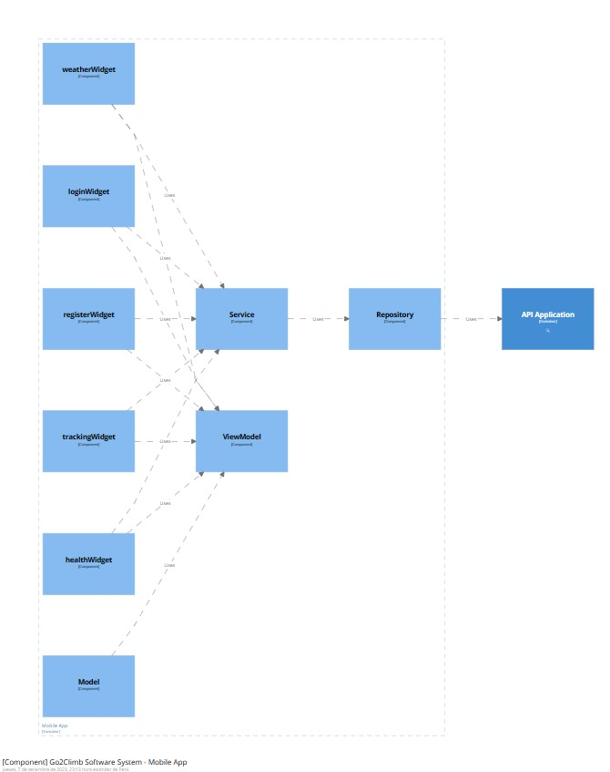

##### Bounded Context IoT Management Software Architecture Code Level Diagrams

###### Bounded Context IoT Management Domain Layer Class Diagrams

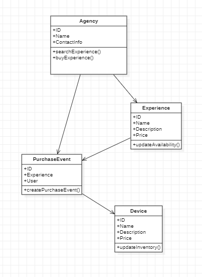

###### Bounded Context IoT Management Database Design Diagram

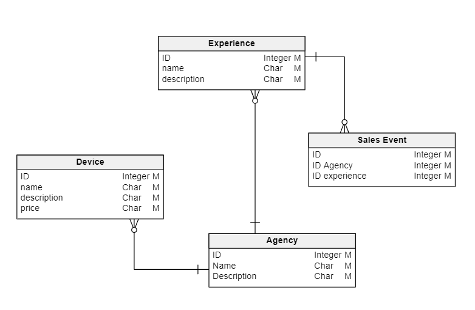
