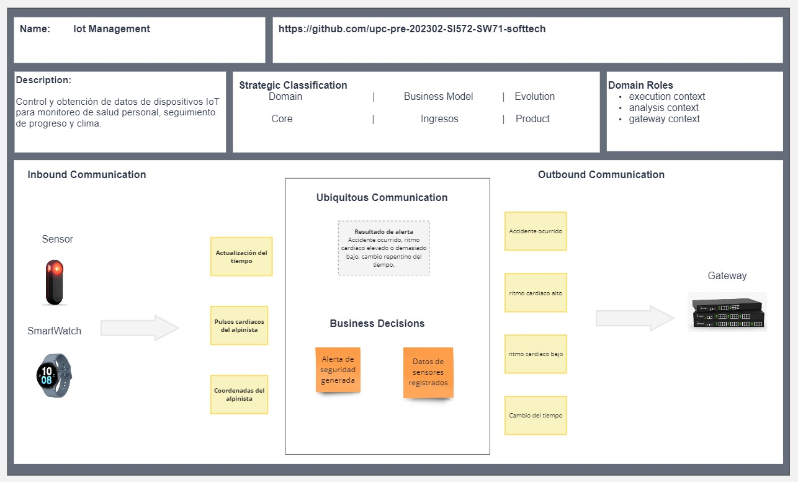

### Strategic-Level Domain-Driven-Design

#### EventStorming

El equipo colaboró efectivamente para explorar y definir las principales ideas que conforman el proceso de creación del EventStorming. Primero, nos organizamos para recapitular los principales procesos y eventos que ocurren en nuestro sistema, es así que fuimos realizando el procesos del event storming, el cual se muestra a continuación:

##### Candidate Context Discovery

En este apartado, identificamos mediante la técnica de start-with-value los contextos candidatos al profundo análisis de su funcionamiento. Esto debido a que representan la lógica principal del modelo de negocio. Se definen de manera precisa cada etapa del proceso que buscamos que los usuarios sigan al usar nuestro sistema. Estos bounded context son los que conforman nuestro sistema.

##### Domain Message Flows Modeling

En este apartado, evidenciamos el correcto flujo de procesos ocurridos durante el uso de nuestro sistema, la interconexión e interacción entre los bounded contexts planteados y los elementos que los conforman para cumplir con el escenario ideal planteado.

##### Bounded Context Canvases

De igual manera que en las secciones previas, definimos los canvases de los bounded contexts más relevantes en nuestro sistema. En estos, describimos a profundidad el contenido establecido en el Event Storming.

#### Context Mapping

#### Software Architecture

##### Software Architecture System Landscape Diagram

##### Software Architecture Context Level Diagrams

##### Software Architecture Container Level Diagrams

##### Software Architecture Deployment Diagrams

### Tactical-Level Domain-Driven Design

#### Bounded Context <!--Bound Context Name-->

##### Domain Layer

##### Interface Layer

##### Application Layer

##### Infraestructure Layer

##### Bounded Context Software Architecture Component Level Diagrams

##### Bounded Context Software Architecture Code Level Diagrams

###### Bounded Context Domain Layer Class Diagrams

###### Bounded Context Database Design Diagram
