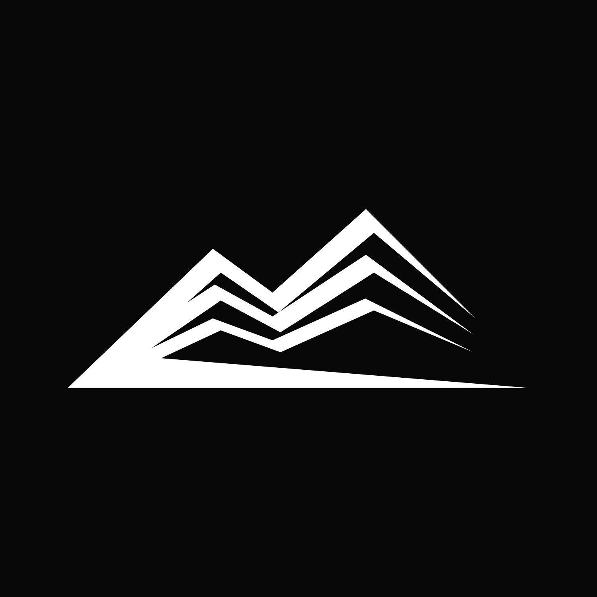

### Style Guidelines

En esta sección nuestro equipo sienta las bases para tener un repositorio central y organizado de uso común para el
equipo. En este repositorio se encuentran los siguientes documentos: General Style Guidelines, Web Style Guidelines y
Mobile Style Guidelines.

#### General Style Guidelines

En esta sección se explica las decisiones y referencias visuales sobre conceptos generál básicos como Branding,
Typography, Colors y Spacing, así como las dimensiones a adoptar para el tono de comunicación y lenguaje aplicado.

##### Branding

Go2Climb es una representación visual de nuestra pasión por las colinas y la aventura en la naturaleza. Nuestro logo
incorpora las formas de las colinas y líneas que evocan señales, simbolizando la conexión en lugares remotos donde se
practican deportes como el alpinismo y el senderismo. Go2Climb redefine la experiencia al aire libre al inspirar la
exploración y la superación de desafíos en entornos naturales, siempre manteniendo nuestra identidad distintiva y
auténtica.

##### Logo

El diseño de Go2Climb, con su paleta de colores blanco y negro, encarna la simplicidad y el minimalismo, reflejando la
elegancia y la claridad en la exploración de la naturaleza. Los rayos no solo simbolizan señales, sino también rutas y
precisión en actividades al aire libre, mientras que las formas de colina representan la diversidad de experiencias y la
progresión en la aventura. Nuestra marca es versátil, con variantes en fondo negro y blanco que destacan el contraste y
la resistencia, adaptándose a diferentes contextos visuales. En conjunto, el diseño de Go2Climb comunica la pasión por
la aventura y la conexión en lugares remotos de manera efectiva y atractiva.

##### Typography

La elección de la tipografía es un aspecto importante en la identidad de marca de Go2Climb. Nuestra marca utiliza dos
fuentes principales: una sans serif y Arial. Sans Serif (Fuente Principal): La tipografía sans serif es conocida por su
simplicidad y legibilidad. Representa la esencia minimalista y moderna de Go2Climb. Esta fuente se utiliza en nuestro
logotipo y en los encabezados de nuestros materiales de marketing. Proporciona un aspecto limpio y contemporáneo que
complementa la simplicidad de nuestra paleta de colores y el diseño general de nuestra marca.

Arial (Fuente Secundaria): Arial es una fuente versátil y legible que se utiliza para el contenido principal en nuestros
materiales de comunicación. Su simplicidad y claridad aseguran que la información que compartimos sea fácilmente
comprensible por nuestros usuarios y refuerza la idea de que Go2Climb ofrece soluciones accesibles y confiables.
La combinación de estas dos fuentes, sans serif para el énfasis en el diseño y la identidad, y Arial para la claridad en
la comunicación, crea una armonía en la tipografía de Go2Climb que refuerza nuestra imagen de marca de simplicidad,
seguridad y modernidad. Esta elección tipográfica se alinea con nuestra filosofía de ofrecer soluciones tecnológicas de
vanguardia de manera accesible y fácil de entender.

##### Colors

La paleta de Go2Climb están diseñados para transmitir simplicidad, elegancia y versatilidad. Aquí están los colores
principales y sus códigos en formato hexadecimal:

Blanco: El color blanco (#FFFFFF) simboliza la pureza, la claridad y la seguridad. Es el color predominante en nuestro
diseño y representa la esencia de Go2Climb: la búsqueda de experiencias al aire libre sin preocupaciones.

Negro: El negro (#1E1E1E) añade un toque de misterio y elegancia a nuestra marca. Representa la aventura en entornos
nocturnos y desafiantes, subrayando la resistencia y la determinación.

Gris Claro: Un tono de gris claro (#E6E6E6) se utiliza para acentuar y agregar profundidad a nuestro diseño. Refleja la
adaptabilidad y la neutralidad de Go2Climb en diferentes contextos.

Gris Oscuro: Un gris más oscuro (#B3B3B3) proporciona contraste y resalta elementos clave de nuestro diseño. Evoca la
solidez y la confianza que ofrecemos a nuestros usuarios en sus aventuras.

##### Lenguaje Común

En Go2Climb nos comunicamos de manera accesible y versátil, adaptando nuestro lenguaje según la ocasión, pero siempre
manteniendo tres pilares clave: diversión, formalidad y entusiasmo.

Divertida: Adoptamos un enfoque divertido y amigable cuando interactuamos con nuestros usuarios y la comunidad. Nos
gusta compartir historias emocionantes, anécdotas y consejos para hacer que la aventura al aire libre sea aún más
emocionante. Creemos que la diversión es una parte esencial de la experiencia, y esto se refleja en nuestras
publicaciones en redes sociales, blogs y cualquier comunicación que tengamos con nuestros seguidores.

Formal: A pesar de nuestra naturaleza divertida, mantenemos un nivel de formalidad apropiado en nuestras comunicaciones,
especialmente cuando se trata de cuestiones de seguridad y datos. Esto garantiza que nuestros usuarios sientan que
pueden confiar en nosotros para proteger sus intereses y mantener su privacidad. La formalidad también se aplica en
nuestras relaciones comerciales y profesionales.

Entusiasmo: Mostramos entusiasmo genuino por lo que hacemos y lo que ofrecemos. Creemos en la importancia de la conexión
en lugares remotos y en el impacto positivo que nuestra tecnología puede tener en la vida de las personas. Compartimos
esta emoción en cada interacción, ya sea a través de palabras inspiradoras en nuestro sitio web o mensajes de
agradecimiento a nuestros usuarios por ser parte de la comunidad Go2Climb.

#### Web, Mobile and IoT Style Guidelines

### Information Architecture

#### Organization Systems

#### Labeling Systems

#### SEO Tags and Meta Tags

#### Searching Systems

#### Navigation Systems

### Landing Page IJI Design

#### Landing Page Wireframe

#### Landing Page Mock-up

### Applications UX/UI Design

#### Applications Wireframes

#### Applications Wireflow Diagrams

#### Applications Mock-ups

#### Applications User Flow Diagrams

### Applications Prototyping
