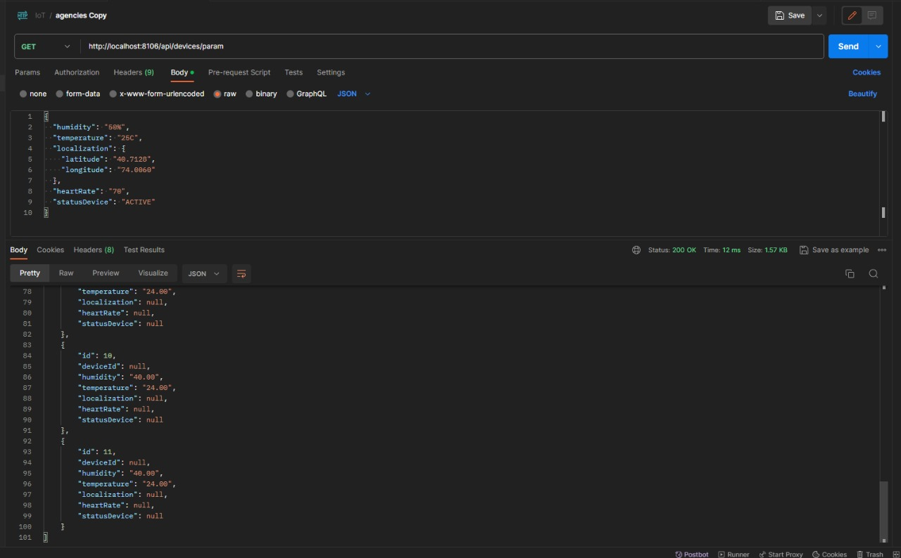

### Software Configuration Management

#### Software Development Environment Configuration

1. Landing Page:

Frontend: Utilizamos HTML, CSS y JavaScript para diseñar una Landing Page atractiva y receptiva que presenta nuestra
solución de IoT de manera efectiva.
Herramientas de Desarrollo: Hemos empleado editores de código como Visual Studio Code para la creación y edición de
código HTML y CSS.
Control de Versiones: Git se utiliza para rastrear y gestionar cambios en el código fuente de la página.

2. Aplicación Móvil (Flutter):

Desarrollo en Flutter: Hemos desarrollado una aplicación móvil multiplataforma utilizando Flutter, que permite una
experiencia de usuario uniforme en dispositivos Android e iOS.
IDE Flutter: Utilizamos el entorno de desarrollo integrado de Flutter para escribir, probar y depurar código de manera
eficiente.
Gestión de Dependencias: Dependemos de pub.dev para gestionar las dependencias y paquetes de Flutter utilizados en
nuestra aplicación.
Control de Versiones: Git y herramientas de colaboración como GitHub se utilizan para colaborar en equipo y mantener un
registro de versiones.

3. Aplicación Web (Angular):

Desarrollo en Angular: La aplicación web principal se desarrolló utilizando el framework Angular de TypeScript para una
experiencia web dinámica y altamente interactiva.
IDE Angular: Empleamos Angular CLI y Visual Studio Code para escribir y administrar el código de Angular.
Gestión de Dependencias: Usamos npm para gestionar las bibliotecas y paquetes de terceros utilizados en nuestra
aplicación Angular.
Pruebas Automatizadas: Configuramos Jasmine y Karma para realizar pruebas unitarias y de integración en nuestra
aplicación Angular.
Control de Versiones: Git y GitHub se utilizan para mantener un control preciso de versiones y colaborar de manera
efectiva.

GitHub:

GitHub es una plataforma de alojamiento de repositorios que actúa como un espacio comunitario para almacenar y gestionar el progreso de proyectos colaborativos desarrollados por equipos. Su función principal es proporcionar un lugar centralizado donde los miembros del equipo pueden contribuir, seguir cambios y mantener un historial de versiones de su trabajo.

WebStorm:
WebStorm es un entorno de desarrollo de JetBrains diseñado específicamente para el desarrollo web en JavaScript.
Facilita la creación y prueba de aplicaciones web al ofrecer herramientas avanzadas para trabajar con lenguajes como
HTML, CSS y JavaScript. Además, permite la visualización instantánea de los cambios en el navegador, lo que agiliza el
proceso de desarrollo.

Visual Studio Code:
Visual Studio Code es un editor de código altamente configurable y potente que ofrece una amplia gama de extensiones
para personalizar y mejorar la eficiencia del desarrollador. Además de ser un excelente editor de código, también se
puede utilizar para construir el backend de nuestras aplicaciones web. Su flexibilidad y comunidad de desarrolladores
activa lo convierten en una herramienta valiosa para proyectos de desarrollo.

Android Studio:

Android Studio es el entorno de desarrollo integrado (IDE) oficial para la creación de aplicaciones Android. Proporciona todas las herramientas necesarias para diseñar, desarrollar y depurar aplicaciones Android de manera eficiente. Con Android Studio, los desarrolladores pueden aprovechar las ventajas de las bibliotecas de Android, el emulador de dispositivos y otras características específicas para crear aplicaciones Android de alta calidad.

#### Source Code Management

Para el seguimiento de modificaciones y control de versiones utilizaremos GitHub. A continuación, presentamos los productos del proyecto y sus respectivos URLs.

repositorio: <https://github.com/upc-pre-202302-SI572-SW71-softtech>

Para estos repositorios anteriormente mencionados se trabajarán bajo la metodología de Git Flow ya que nos permite trabajar de la manera más rápida y óptima para el trabajo colaborativo.

#### Source Code Style Guide & Conventions

Estándares de Desarrollo y Tecnologías Adoptadas:

En la ejecución de nuestro proyecto, hemos abrazado la adopción de estándares de codificación y convenciones
internacionales en una variedad de tecnologías. Esta iniciativa tiene como objetivo principal lograr un proceso de
desarrollo altamente estandarizado y de fácil comprensión para todos los miembros del equipo.

Tecnologías Utilizadas:

Hemos optado por utilizar tecnologías consolidadas, tal como se menciona en nuestra configuración del entorno de
desarrollo. Para ilustrar, en el ámbito del front-end, empleamos la combinación de IntelliJ IDEA y TypeScript. En cuanto
al back-end, Visual Studio Code y Java son nuestras elecciones primordiales. Para la creación de nuestra Landing Page,
confiamos en WebStorm y aprovechamos las capacidades de HTML, CSS y JavaScript. Finalmente, para el desarrollo de
nuestra aplicación móvil, Android Studio se erige como el punto de partida, habilitando la potente plataforma Flutter.

Herramientas de Desarrollo:

Nuestra elección de herramientas también coincide con lo que se describe en nuestra configuración del entorno de desarrollo, abarcando herramientas como LucidChart, Figma, Vertabelo, y más. Estas herramientas son esenciales para diversas tareas, desde la representación gráfica de datos hasta el diseño de interfaces de usuario y la gestión de bases de datos.

Convenciones de Idioma:

Un aspecto crucial de nuestro enfoque es el uso de idiomas específicos para diferentes componentes del proyecto. En el
ámbito de la programación y desarrollo, el idioma inglés se adopta como estándar, ya sea en la Landing Page, el
front-end, el back-end o la aplicación móvil. Esto se extiende incluso a los títulos y descripciones de nuestros commits
en nuestro control de versiones.

#### Software Deployment Configuration

Parkify Frontend No disponible en este Sprint

Parkify Mobile app No disponible en este Sprint

Parkify Backend No disponible en este Sprint

Parkify Landing Page <https://github.com/upc-pre-202302-SI572-SW71-softtech/LandinPage>

### Landing Page, Services & Applications Implementation

#### Sprint 1

En esta sección se registra y explica el avance en términos de producto y trabajo colaborativo para el presente sprint.

##### Sprint 1

En esta sección se registra y explica el avance en términos de producto y trabajo colaborativo para el presente sprint.

##### Sprint Planning 1

| sprint #                           | 1                                                                                                                                                                                                                   |
| ---------------------------------- | ------------------------------------------------------------------------------------------------------------------------------------------------------------------------------------------------------------------- |
| sprint planning background         | Initial setup                                                                                                                                                                                                       |
| date                               | 2023-10-05                                                                                                                                                                                                          |
| time                               | 10:00 AM                                                                                                                                                                                                            |
| location                           | Office                                                                                                                                                                                                              |
| prepare by                         | Jose Cayllahua                                                                                                                                                                                                      |
| Attendees (to planning meeting)    | Team Members                                                                                                                                                                                                        |
| Sprint n – 1 Review Summary        |                                                                                                                                                                                                                     |
| Sprint n – 1 Retrospective Summary |                                                                                                                                                                                                                     |
| Sprint Goal & User Stories         | Desarrollar una landing page y la primera versión de una aplicación web con funcionalidades de registro (register), inicio de sesión (login), visualización de actividades de agencias y visualización de agencias. |
| Sprint n Goal                      | Preparación y configuración inicial para el desarrollo de la página de destino.                                                                                                                                     |
| Sprint n Velocity                  | 8                                                                                                                                                                                                                   |
| Sum of Story Points                | 16                                                                                                                                                                                                                  |

###### Sprint Backlog 1

| sprint # | 1   |
| -------- | --- |

| User Story | Task |
| ---------- | ---- |

| Id US | Title US                           | Id Task | Description Task                                          | Estimate(Hrs) | Assigned to | Status     |
| ----- | ---------------------------------- | ------- | --------------------------------------------------------- | ------------- | ----------- | ---------- |
| US-01 | Desarrollar la landing page        | T-01    | Diseñar la estructura de la página de destino             | 4hr           | Jack        | Completado |
|       |                                    | T-02    | Crear el diseño visual de la landing page                 | 6hr           | Jack        | Completado |
|       |                                    | T-03    | Implementar formulario de contacto                        | 8hr           | Jack        | Completado |
| US-02 | Implementar registro (Register)    | T-04    | Diseñar la interfaz de registro                           | 3hr           | Jerry       | Completado |
|       |                                    | T-05    | Desarrollar lógica de registro                            | 5hr           | Jerry       | Completado |
| US-03 | Desarrollar inicio de sesión       | T-06    | Diseñar la interfaz de inicio de sesión                   | 3hr           | Arturo      | Completado |
|       |                                    | T-07    | Implementar lógica de inicio de sesión                    | 5hr           | Arturo      | Completado |
| US-04 | Visualizar actividades de agencias | T-08    | Diseñar la interfaz de visualización de actividades       | 4hr           | Jerry       | Completado |
|       |                                    | T-09    | Desarrollar funcionalidad de visualización de actividades | 6hr           | Jose        | Completado |
| US-05 | Visualizar agencias                | T-10    | Diseñar la interfaz de visualización de agencias          | 3hr           | Jack        | Completado |
|       |                                    | T-11    | Implementar funcionalidad de visualización de agencias    | 5hr           | Jack        | Completado |

###### Development Evidence for Sprint Review

| Repository                                    | Branch  | Commit id | Commit Message | Commit Message body | Commit on (date) |
| --------------------------------------------- | ------- | --------- | -------------- | ------------------- | ---------------- |
| upc-pre-202302-SI572-SW71-softtech/LandinPage | main    | 497c0d3   |                |                     | 27/09/23         |
| upc-pre-202302-SI572-SW71-softtech/Frontend   | develop |           |                |                     | 27/09/23         |

###### Testing Suite Evidence for Sprint Review

No hubo testing en esta entrega.

###### Execution Evidence for Sprint Review

###### Software Deployment Evidence for Sprint Review

###### Team Collaboration Insights during Sprint

#### Sprint 2

##### Sprint Planning 2

| sprint 2                        |                                                                                                                               |
| ------------------------------- | ----------------------------------------------------------------------------------------------------------------------------- |
| sprint planning background      | Desarrollo de todas las soluciones(mobile app, webservice, embebed aplication)                                                |
| date                            | 2023-10-17                                                                                                                    |
| time                            | 9am                                                                                                                           |
| location                        | Office                                                                                                                        |
| prepare by                      | Jack                                                                                                                          |
| Attendees (to planning meeting) | Team Members                                                                                                                  |
| Sprint 2 Review Summary         | Contribucion de todos los integrantes en las soluciones.                                                                      |
| Sprint 2 Retrospective Summary  | Mejorar la entra de la documentacion y contribuir todos los integrantes en el desarrollo de las soluciones                    |
| Sprint 2 Goal & User Stories    | Desarrollar la apliacion mobile, implementar el embebed application e implementar webservice backend. Mejorar Web application |
| Sprint 2 Goal                   | Implementar Caracteristicas principales de la solucion en conjunto.                                                           |
| Sprint 2 Velocity               | 42                                                                                                                            |
| Sum of Story Points             | 42                                                                                                                            |

##### Sprint Backlog 2

!include (../partials/sprint-backlog-2-table.html)

##### Development Evidence for Sprint Review

| Repository                                                                                    | Branch  | Commit id | Commit Message | Commit Message body | Commit on (date) |
| --------------------------------------------------------------------------------------------- | ------- | --------- | -------------- | ------------------- | ---------------- |
| upc-pre-202302-SI572-SW71-softtech/LandinPage                                                 | main    | 497c0d3   |                |                     | 27/10/23         |
| upc-pre-202302-SI572-SW71-softtech/web_app                                                    | develop |           |                |                     | 04/11/23         |
| upc-pre-202302-SI572-SW71-softtech/Backend                                                    | main    | 497c2d3   |                |                     | 04/11/23         |
| upc-pre-202302-SI572-SW71-softtech/embebed-application-milestoneembebed-application-milestone | main    | 497b1d3   |                |                     | 04/11/23         |
| upc-pre-202302-SI572-SW71-softtech/mobile_app_fluttermobile_app_flutter                       | main    | 497e5d3   |                |                     | 02/11/23         |

##### Testing Suite Evidence for Sprint Review

En esta sección, presentamos evidencia clave relacionada con las pruebas realizadas en el sprint actual para el frontend. Esto incluye capturas de pantalla y resultados de dos importantes aspectos de nuestro proceso de calidad: las pruebas de rendimiento realizadas con RedLine13 y el análisis de calidad de código utilizando SonarQube.

###### RedLine13

Adjuntamos capturas de pantalla de las pruebas de rendimiento y carga realizadas en nuestra aplicación utilizando RedLine13. Estas capturas de pantalla ilustran cómo nuestra aplicación se comporta bajo condiciones de carga simuladas y proporcionan información sobre tiempos de respuesta, recursos utilizados y otros datos relevantes.

###### Análisis de SonarQube

Presentamos un resumen del análisis de calidad del código de nuestra aplicación utilizando SonarQube. Esto incluye métricas de calidad del código, identificación de problemas potenciales, código repetido y cualquier deuda técnica identificada.

##### Execution Evidence for Sprint Review

##### Software Deployment Evidence for Sprint Review

**Evidencia de Despliegue del Software para la Revisión del Sprint:**

En esta sección, proporcionamos pruebas visuales y documentadas del proceso de despliegue de nuestra aplicación web como parte de la revisión de sprint. Esta evidencia respalda la transparencia y la calidad de nuestro trabajo en el contexto de este sprint.

Deployed Web App: <https://go2climb-softtech-v1.netlify.app>

Deployed WebAPI: <https://backendiot.azurewebsites.net/swagger-ui/index.html>

Deployed APK: <https://github.com/upc-pre-202302-SI572-SW71-softtech/mobile_app_flutter/releases/download/TF/Go2Climb.apk>

Wokwi Project Link: <https://wokwi.com/projects/378234930126673921>

DeplOyed Landing Page: <https://upc-pre-202302-si572-sw71-softtech.github.io/landinpage-go2climb/>

##### Team Collaboration Insight during Sprint

**Análisis de Colaboración del Equipo durante el Sprint:**

En este apartado, compartimos una imagen que muestra los insights del repositorio del web app, proporcionando una visión en profundidad de la colaboración del equipo durante el sprint. Estos datos reflejan nuestro enfoque en la comunicación efectiva, la sinergia y el trabajo conjunto para lograr nuestros objetivos de sprint.

#### Sprint 3

##### Sprint Planning 3

| sprint 3                        |                                                                                                             |
| ------------------------------- | ----------------------------------------------------------------------------------------------------------- |
| sprint planning background      | Desarrollo de todas las soluciones(mobile app, webservice, embebed aplication)                              |
| date                            | 2023-11-22                                                                                                  |
| time                            | 11pm                                                                                                        |
| location                        | Office                                                                                                      |
| prepare by                      | Jerry                                                                                                       |
| Attendees (to planning meeting) | Team Members                                                                                                |
| Sprint 3 Review Summary         | Contribución de todos los integrantes en las soluciones.                                                    |
| Sprint 3 Retrospective Summary  | Mejorar la documentación del proyecto y contribuir todos los integrantes en el desarrollo de las soluciones |
| Sprint 3 Goal & User Stories    | Mejorar y finalizar los productos, mobile application, web application y embedded application               |
| Sprint 3 Goal                   | Completar y mejorar características pendientes de la aplicación móvil y web.                                |
| Sprint 3 Velocity               | 23                                                                                                          |
| Sum of Story Points             | 23                                                                                                          |

##### Sprint Backlog 3

!include (../partials/sprint-backlog-3-table.html)

##### Development Evidence for Sprint Review

| Repository                                                                                    | Branch  | Commit id | Commit Message | Commit Message body | Commit on (date) |
| --------------------------------------------------------------------------------------------- | ------- | --------- | -------------- | ------------------- | ---------------- |
| upc-pre-202302-SI572-SW71-softtech/LandinPage                                                 | main    | 497c0d3   |                |                     | 27/10/23         |
| upc-pre-202302-SI572-SW71-softtech/web_app                                                    | develop |           |                |                     | 04/11/23         |
| upc-pre-202302-SI572-SW71-softtech/Backend                                                    | main    | 497c2d3   |                |                     | 04/11/23         |
| upc-pre-202302-SI572-SW71-softtech/embebed-application-milestoneembebed-application-milestone | main    | 497b1d3   |                |                     | 04/11/23         |
| upc-pre-202302-SI572-SW71-softtech/mobile_app_fluttermobile_app_flutter                       | main    | 497e5d3   |                |                     | 02/11/23         |

##### Testing Suite Evidence for Sprint Review

En esta sección, presentamos evidencia clave relacionada con las pruebas realizadas en el sprint actual para el frontend. Esto incluye capturas de pantalla y resultados de dos importantes aspectos de nuestro proceso de calidad: las pruebas de rendimiento realizadas con RedLine13 y el análisis de calidad de código utilizando SonarQube.

###### RedLine13

Adjuntamos capturas de pantalla de las pruebas de rendimiento y carga realizadas en nuestra aplicación utilizando RedLine13. Estas capturas de pantalla ilustran cómo nuestra aplicación se comporta bajo condiciones de carga simuladas y proporcionan información sobre tiempos de respuesta, recursos utilizados y otros datos relevantes.

###### Análisis de SonarQube

Presentamos un resumen del análisis de calidad del código de nuestra aplicación utilizando SonarQube. Esto incluye métricas de calidad del código, identificación de problemas potenciales, código repetido y cualquier deuda técnica identificada.

##### Execution Evidence for Sprint Review

##### Software Deployment Evidence for Sprint Review

**Evidencia de Despliegue del Software para la Revisión del Sprint:**

En esta sección, proporcionamos pruebas visuales y documentadas del proceso de despliegue de nuestra aplicación web como parte de la revisión de sprint. Esta evidencia respalda la transparencia y la calidad de nuestro trabajo en el contexto de este sprint.

##### Team Collaboration Insight during Sprint

**Análisis de Colaboración del Equipo durante el Sprint:**

En este apartado, compartimos una imagen que muestra los insights del repositorio del web app, proporcionando una visión en profundidad de la colaboración del equipo durante el sprint. Estos datos reflejan nuestro enfoque en la comunicación efectiva, la sinergia y el trabajo conjunto para lograr nuestros objetivos de sprint.

### Validation Interviews

La sección de 'Validation Interviews' constituye una etapa crucial dentro del proceso de validación de nuestro producto. En esta fase, llevamos a cabo entrevistas específicas y estructuradas con usuarios, clientes potenciales o stakeholders clave. El propósito principal es recopilar información detallada y retroalimentación directa sobre la percepción, experiencias y necesidades de los usuarios en relación con nuestro producto.

#### Diseño de Entrevistas

**Preguntas principales y complementarias para entrevistas:**

Como parte del análisis needfinding del proyecto, un paso importante que hay que seguir es la realización de entrevistas a los segmentos objetivos para la captación de necesidades y oportunidad de enfatizar con ellos en busca de la creación de la mejor solución software.

A continuación, se presenta la línea de secuencias y la lista de preguntas a realizar a nuestros usuarios.

**Segmento de agencias:**

Bienvenida {.small-subtitle}

Hola buenas (días/tardes/noches), estoy trabajando en una idea de negocio que pretende ayudar a mejorar la experiencia de alpinismo en un ambiente mucho más social y conociendo personas qué también disfruten este deporte. Tenemos una serie de teorías respecto a los problemas que se enfrentan los turistas de aventura al momento de buscar empresas de alpinismo confiables y quisiera contrastarlas contigo para ver si estamos en lo cierto o no. Si te parece comenzaré con algunas preguntas a continuación y al finalizar te cuento de qué va el proyecto.

Datos demográficos {.small-subtitle}

¿Podrías contarnos un poco más de ti? (Un poco de tu historia, quien eres, tu edad, dónde vives, estudios, si es que trabajas actualmente, responsabilidades cotidianas, hobbies, etc.)

La Personas debe responder lo siguiente, de lo contrario preguntar sobre estos tópicos:

· Nombre

· Edad

· Distrito de residencia

· Estado civil

· Familia

· Ocupación

· Hobbies

Ahora a manera de dinámica, mencionaré algunas frases y responde como mejor creas conveniente (esta parte realizar como un tipo de ping pong de preguntas y respuestas):

· Programas de televisión de la infancia

· Programas de televisión de la actualidad

· Carro particular o transporte público

· Android o Apple

· Windows, Linux o Mac

· Aprendizaje guiado o autodidacta

· Ver una película o leer un libro

· Redes sociales más utilizadas

· Menciona 2 otras apps (diferente a redes sociales, pueden ser juegos de celular también) que utilices frecuentemente

· Plan telefónico prepago o postpago

· Banco preferido

Principales problemas {.medium-subtitle}

· ¿Cuánta experiencia tienes como guía en alpinismo?

· ¿Has utilizado servicios de publicidad para incrementar el flujo de clientes? ¿Qué servicios has utilizado? ¿Cuán efectivos han sido?

· ¿Qué medios utilizas para comunicarte con tus clientes? ¿Cuál es tu favorito?

· ¿Has tenido alguna mala experiencia con tus clientes cuando contratan tus servicios? ¿Cómo fue?

· ¿Cómo gestionas los pagos de tus servicios con tus clientes?

· ¿Qué crees que buscan los turistas cuando buscan contratar algún servicio de alpinismo?

· ¿Cuántas personas en promedio anual usan tu servicio?

· ¿Consideras que hay una comunidad grande de personas que realizan montañismo o alpinismo? (la respuesta será no así que.) ¿Cómo crees que se podría cambiar eso?

· ¿Qué crees que es lo que el cliente valora más del servicio?

· ¿Crees que publicándolos en una plataforma enfocada en montañismo aumentaría o disminuiría el alcance que tienes actualmente? ¿Por qué?

**Breve Pitch:**

Estamos desarrollando una plataforma web enfocada en ofrecer servicios de alpinismo. Las empresas podrán publicitarse en la plataforma, junto con los precios, rutas, itinerarios, horarios y experiencias. Asimismo, los turistas podrán seleccionar la empresa de su preferencia, reaccionar a las experiencias y calificar a la empresa.

Compromiso {.medium-subtitle}

¿Qué te ha parecido? ¿Tienes alguna recomendación para nosotros?

Gracias por habernos concedido esta entrevista, tus respuestas son valiosas para nosotros

Como último punto, nos gustaría pedirte una reunión otra vez de aquí a unas cuantas semanas, donde te podremos mostrarte cómo va el desarrollo de nuestra idea, donde podremos mostrarte el prototipo de nuestra aplicación y obtener retroalimentación de ti una vez más.

#### Registro de Entrevistas

##### Entrevista N°1

<!--Change data for each person-->

- Nombre: Sebastián Andre Ramírez Mendez
- Edad: 21 años
- Residencia: La Victoria
- Segmento Objetivo: Turista
- Enlace de entrevista: <https://upcedupe-my.sharepoint.com/:v:/g/personal/u20201c043_upc_edu_pe/EbIOtzoLbf1EpxDm1C801xQBNW9Jq5ljlu4GqbHZDDYUrg?e=hdq4HQ&nav=eyJyZWZlcnJhbEluZm8iOnsicmVmZXJyYWxBcHAiOiJTdHJlYW1XZWJBcHAiLCJyZWZlcnJhbFZpZXciOiJTaGFyZURpYWxvZy1MaW5rIiwicmVmZXJyYWxBcHBQbGF0Zm9ybSI6IldlYiIsInJlZmVycmFsTW9kZSI6InZpZXcifX0%3D>.
- Timing: 00:00
- Duración: 06:25 minutos
- Resumen: Un aventurero amante de los deportes extremos, compartió su deseo de utilizar tecnología avanzada para mejorar su seguridad y experiencia mientras realiza actividades alpinas. Busca dispositivos y herramientas que le proporcionen datos en tiempo real sobre su ubicación y salud, así como alertas de seguridad. Además, destacó la importancia de mantenerse conectado durante sus aventuras.

##### Entrevista N°2

<!--Change data for each person-->

- Nombre: Nilda Sharol Flores Ramirez
- Edad: 23 años
- Residencia: Mozambique
- Segmento Objetivo: Agency Manager
- Enlace de entrevista: <https://upcedupe-my.sharepoint.com/:v:/g/personal/u20201c043_upc_edu_pe/EWj_pWHlKMxMj0CTteUf_AoBxLDHJ035D3R02dqXrngufg?e=N0hPmI&nav=eyJyZWZlcnJhbEluZm8iOnsicmVmZXJyYWxBcHAiOiJTdHJlYW1XZWJBcHAiLCJyZWZlcnJhbFZpZXciOiJTaGFyZURpYWxvZy1MaW5rIiwicmVmZXJyYWxBcHBQbGF0Zm9ybSI6IldlYiIsInJlZmVycmFsTW9kZSI6InZpZXcifX0%3D>.
- Timing: 06:26
- Duración: 04:25 minutos
- Resumen: Durante la conversación, una entusiasta de actividades al aire libre, se resaltó su necesidad de encontrar y reservar servicios de alpinismo de manera sencilla y segura. Valoró la conveniencia de tener acceso a información detallada sobre las rutas y el clima antes de comprometerse con una actividad. María también mencionó que las reseñas de otros usuarios son fundamentales para tomar decisiones informadas.

Análisis General: Ambas entrevistas resaltaron la relevancia de la seguridad, la conveniencia y la tecnología en la experiencia de los turistas que participan en actividades alpinas. Los usuarios como

### Video About-the-Product

[About the Product video link](https://upcedupe-my.sharepoint.com/personal/u20201c043_upc_edu_pe/_layouts/15/stream.aspx?id=%2Fpersonal%2Fu20201c043%5Fupc%5Fedu%5Fpe%2FDocuments%2FRecordings%2FReuni%C3%B3n%20con%20u20201c043%20%28Quispe%20Gavilan%2C%20Jerry%29%2D20231123%5F052207%2DGrabaci%C3%B3n%20de%20la%20reuni%C3%B3n%2Emp4&nav=eyJyZWZlcnJhbEluZm8iOnsicmVmZXJyYWxBcHAiOiJTdHJlYW1XZWJBcHAiLCJyZWZlcnJhbFZpZXciOiJTaGFyZURpYWxvZy1MaW5rIiwicmVmZXJyYWxBcHBQbGF0Zm9ybSI6IldlYiIsInJlZmVycmFsTW9kZSI6InZpZXcifX0&ga=1&referrer=StreamWebApp%2EWeb&referrerScenario=AddressBarCopied%2Eview)
