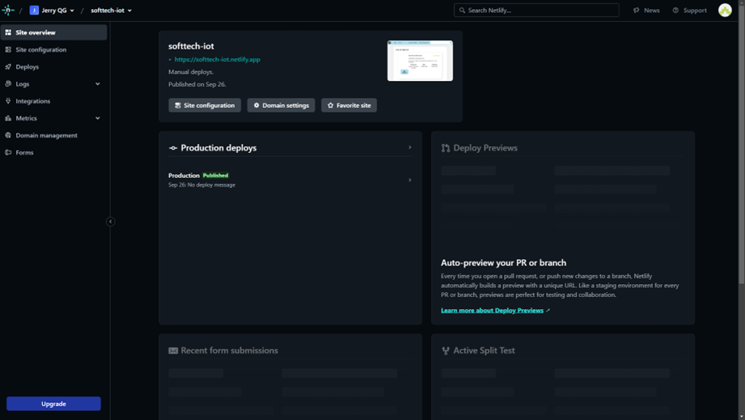

### Software Configuration Management

#### Software Development Environment Configuration

1. Landing Page:

Frontend: Utilizamos HTML, CSS y JavaScript para diseñar una Landing Page atractiva y receptiva que presenta nuestra
solución de IoT de manera efectiva.
Herramientas de Desarrollo: Hemos empleado editores de código como Visual Studio Code para la creación y edición de
código HTML y CSS.
Control de Versiones: Git se utiliza para rastrear y gestionar cambios en el código fuente de la página.

2. Aplicación Móvil (Flutter):

Desarrollo en Flutter: Hemos desarrollado una aplicación móvil multiplataforma utilizando Flutter, que permite una
experiencia de usuario uniforme en dispositivos Android e iOS.
IDE Flutter: Utilizamos el entorno de desarrollo integrado de Flutter para escribir, probar y depurar código de manera
eficiente.
Gestión de Dependencias: Dependemos de pub.dev para gestionar las dependencias y paquetes de Flutter utilizados en
nuestra aplicación.
Control de Versiones: Git y herramientas de colaboración como GitHub se utilizan para colaborar en equipo y mantener un
registro de versiones.

3. Aplicación Web (Angular):

Desarrollo en Angular: La aplicación web principal se desarrolló utilizando el framework Angular de TypeScript para una
experiencia web dinámica y altamente interactiva.
IDE Angular: Empleamos Angular CLI y Visual Studio Code para escribir y administrar el código de Angular.
Gestión de Dependencias: Usamos npm para gestionar las bibliotecas y paquetes de terceros utilizados en nuestra
aplicación Angular.
Pruebas Automatizadas: Configuramos Jasmine y Karma para realizar pruebas unitarias y de integración en nuestra
aplicación Angular.
Control de Versiones: Git y GitHub se utilizan para mantener un control preciso de versiones y colaborar de manera
efectiva.

GitHub:

GitHub es una plataforma de alojamiento de repositorios que actúa como un espacio comunitario para almacenar y gestionar el progreso de proyectos colaborativos desarrollados por equipos. Su función principal es proporcionar un lugar centralizado donde los miembros del equipo pueden contribuir, seguir cambios y mantener un historial de versiones de su trabajo.

WebStorm:
WebStorm es un entorno de desarrollo de JetBrains diseñado específicamente para el desarrollo web en JavaScript.
Facilita la creación y prueba de aplicaciones web al ofrecer herramientas avanzadas para trabajar con lenguajes como
HTML, CSS y JavaScript. Además, permite la visualización instantánea de los cambios en el navegador, lo que agiliza el
proceso de desarrollo.

Visual Studio Code:
Visual Studio Code es un editor de código altamente configurable y potente que ofrece una amplia gama de extensiones
para personalizar y mejorar la eficiencia del desarrollador. Además de ser un excelente editor de código, también se
puede utilizar para construir el backend de nuestras aplicaciones web. Su flexibilidad y comunidad de desarrolladores
activa lo convierten en una herramienta valiosa para proyectos de desarrollo.

Android Studio:

Android Studio es el entorno de desarrollo integrado (IDE) oficial para la creación de aplicaciones Android. Proporciona todas las herramientas necesarias para diseñar, desarrollar y depurar aplicaciones Android de manera eficiente. Con Android Studio, los desarrolladores pueden aprovechar las ventajas de las bibliotecas de Android, el emulador de dispositivos y otras características específicas para crear aplicaciones Android de alta calidad.

#### Source Code Management

Para el seguimiento de modificaciones y control de versiones utilizaremos GitHub. A continuación, presentamos los productos del proyecto y sus respectivos URLs.

repositorio: <https://github.com/upc-pre-202302-SI572-SW71-softtech>

Para estos repositorios anteriormente mencionados se trabajarán bajo la metodología de Git Flow ya que nos permite trabajar de la manera más rápida y óptima para el trabajo colaborativo.

#### Source Code Style Guide & Conventions

Estándares de Desarrollo y Tecnologías Adoptadas:

En la ejecución de nuestro proyecto, hemos abrazado la adopción de estándares de codificación y convenciones
internacionales en una variedad de tecnologías. Esta iniciativa tiene como objetivo principal lograr un proceso de
desarrollo altamente estandarizado y de fácil comprensión para todos los miembros del equipo.

Tecnologías Utilizadas:

Hemos optado por utilizar tecnologías consolidadas, tal como se menciona en nuestra configuración del entorno de
desarrollo. Para ilustrar, en el ámbito del front-end, empleamos la combinación de IntelliJ IDEA y TypeScript. En cuanto
al back-end, Visual Studio Code y Java son nuestras elecciones primordiales. Para la creación de nuestra Landing Page,
confiamos en WebStorm y aprovechamos las capacidades de HTML, CSS y JavaScript. Finalmente, para el desarrollo de
nuestra aplicación móvil, Android Studio se erige como el punto de partida, habilitando la potente plataforma Flutter.

Herramientas de Desarrollo:

Nuestra elección de herramientas también coincide con lo que se describe en nuestra configuración del entorno de desarrollo, abarcando herramientas como LucidChart, Figma, Vertabelo, y más. Estas herramientas son esenciales para diversas tareas, desde la representación gráfica de datos hasta el diseño de interfaces de usuario y la gestión de bases de datos.

Convenciones de Idioma:

Un aspecto crucial de nuestro enfoque es el uso de idiomas específicos para diferentes componentes del proyecto. En el
ámbito de la programación y desarrollo, el idioma inglés se adopta como estándar, ya sea en la Landing Page, el
front-end, el back-end o la aplicación móvil. Esto se extiende incluso a los títulos y descripciones de nuestros commits
en nuestro control de versiones.

#### Software Deployment Configuration

Parkify Frontend No disponible en este Sprint

Parkify Mobile app No disponible en este Sprint

Parkify Backend No disponible en este Sprint

Parkify Landing Page <https://github.com/upc-pre-202302-SI572-SW71-softtech/LandinPage>

### Landing Page, Services & Applications Implementation

#### Sprint 1

En esta sección se registra y explica el avance en términos de producto y trabajo colaborativo para el presente sprint.

##### Sprint Planning 1

##### Sprint Backlog 1

##### Development Evidence for Sprint Review

##### Testing Suite Evidence for Sprint Review

##### Execution Evidence for Sprint Review

##### Services Documentation Evidence for Sprint Review

##### Software Deployment Evidence for Sprint Review

##### Team Collaboration Insights during Sprint

#### Validation Interviews

##### Diseño de entrevistas

##### Registro de Entrevistas

##### Landing Page, Services & Applications Implementation.

##### Sprint 1

En esta sección se registra y explica el avance en términos de producto y trabajo colaborativo para el presente sprint.

##### Sprint Planning 1.

| sprint #                           | 1                                                                                                                                                                                                                   |
|------------------------------------|---------------------------------------------------------------------------------------------------------------------------------------------------------------------------------------------------------------------|
| sprint planning background         | Initial setup                                                                                                                                                                                                       |
| date                               | 2023-10-05                                                                                                                                                                                                          |
| time                               | 10:00 AM                                                                                                                                                                                                            |
| location                           | Office                                                                                                                                                                                                              |
| prepare by                         | Jose Cayallua                                                                                                                                                                                                       |
| Attendees (to planning meeting)    | Team Members                                                                                                                                                                                                        |
| Sprint n – 1 Review Summary        |                                                                                                                                                                                                                     |
| Sprint n – 1 Retrospective Summary |                                                                                                                                                                                                                     |
| Sprint Goal & User Stories         | Desarrollar una landing page y la primera versión de una aplicación web con funcionalidades de registro (register), inicio de sesión (login), visualización de actividades de agencias y visualización de agencias. |
| Sprint n Goal                      | Preparación y configuración inicial para el desarrollo de la página de destino.                                                                                                                                     |
| Sprint n Velocity                  | 8                                                                                                                                                                                                                   |
| Sum of Story Points                | 16                                                                                                                                                                                                                  |

###### Sprint Backlog 1.

| sprint # | 1 |
|----------|---|

| User Story | Task |
|------------|------|

| Id US | Title US                           | Id Task | Description Task                                          | Estimate(Hrs) | Assigned to | Status     |
|-------|------------------------------------|---------|-----------------------------------------------------------|---------------|-------------|------------|
| US-01 | Desarrollar la landing page        | T-01    | Diseñar la estructura de la página de destino             | 4hr           | Jack        | Completado |
|       |                                    | T-02    | Crear el diseño visual de la landing page                 | 6hr           | Jack        | Completado |
|       |                                    | T-03    | Implementar formulario de contacto                        | 8hr           | Jack        | Completado |
| US-02 | Implementar registro (Register)    | T-04    | Diseñar la interfaz de registro                           | 3hr           | Jerry       | Completado |
|       |                                    | T-05    | Desarrollar lógica de registro                            | 5hr           | Jerry       | Completado |
| US-03 | Desarrollar inicio de sesión       | T-06    | Diseñar la interfaz de inicio de sesión                   | 3hr           | Arturo      | Completado |
|       |                                    | T-07    | Implementar lógica de inicio de sesión                    | 5hr           | Arturo      | Completado |
| US-04 | Visualizar actividades de agencias | T-08    | Diseñar la interfaz de visualización de actividades       | 4hr           | Jerry       | Completado |
|       |                                    | T-09    | Desarrollar funcionalidad de visualización de actividades | 6hr           | Jose        | Completado |
| US-05 | Visualizar agencias                | T-10    | Diseñar la interfaz de visualización de agencias          | 3hr           | Jack        | Completado |
|       |                                    | T-11    | Implementar funcionalidad de visualización de agencias    | 5hr           | Jack        | Completado |

###### Development Evidence for Sprint Review.

| Repository                                    | Branch  | Commit id | Commit Message | Commit Message body | Commit on (date) |
|-----------------------------------------------|---------|-----------|----------------|---------------------|------------------|
| upc-pre-202302-SI572-SW71-softtech/LandinPage | main    | 497c0d3   |                |                     | 27/09/23         |
| upc-pre-202302-SI572-SW71-softtech/Frontend   | develop |           |                |                     | 27/09/23         |

###### Testing Suite Evidence for Sprint Review.

No hubo testing en esta entrega.

###### Execution Evidence for Sprint Review.

###### Software Deployment Evidence for Sprint Review.

###### Team Collaboration Insights during Sprint.

