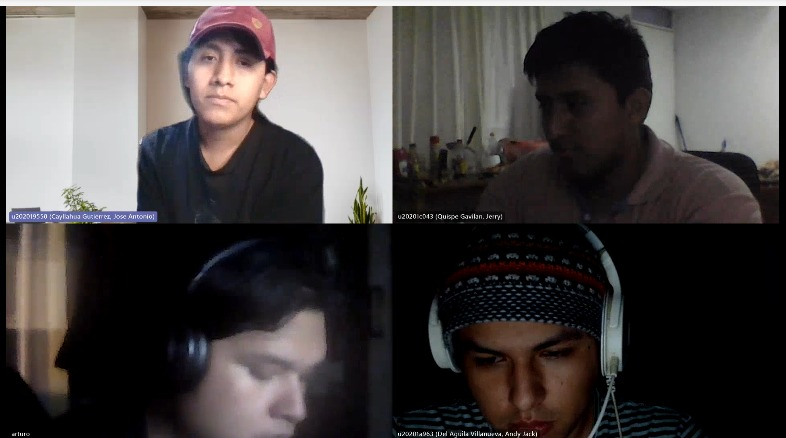

!include (cover.md)

{.page-break}

## Registro de Versiones del Informe

!include (registro-de-versiones.md)

{.page-break}

## Project Report Collaboration Insights

!include (report-collaboration-insights.md)

{.page-break}

!include (toc.md)

{.page-break}

## Student Outcome

!include (student-outcome.md)

{.page-break}

## Capítulo I: Introducción

!include (chapters/1-intro.md)

{.page-break}

## Capítulo II: Requirements Elicitation & Analysis

!include (chapters/2-requirements-elicitation.md)

{.page-break}

## Capítulo III: Requirements Specification

!include (chapters/3-requirements-specification.md)

## Capítulo IV: Solution Software Design

!include (chapters/4-solution-software-design.md)

## Capítulo V: Solution UI/UX Design

!include (chapters/5-solution-ui-ux-design.md)

## Capítulo VI: Product Implementation, Validation & Deployment

!include (chapters/6-product-implementation.md)

## Conclusiones

!include (conclusiones.md)

[About the team video link](<https://upcedupe-my.sharepoint.com/:v:/r/personal/u20201c043_upc_edu_pe/Documents/Recordings/Reuni%C3%B3n%20con%20u20201c043%20(Quispe%20Gavilan,%20Jerry)-20231123_051322-Grabaci%C3%B3n%20de%20la%20reuni%C3%B3n.mp4?csf=1&web=1&e=lNGLa1&nav=eyJyZWZlcnJhbEluZm8iOnsicmVmZXJyYWxBcHAiOiJTdHJlYW1XZWJBcHAiLCJyZWZlcnJhbFZpZXciOiJTaGFyZURpYWxvZy1MaW5rIiwicmVmZXJyYWxBcHBQbGF0Zm9ybSI6IldlYiIsInJlZmVycmFsTW9kZSI6InZpZXcifX0%3D>)

## Bibliografia

!include (bibliografia.md)

{.page-break}

## Anexos

!include (anexos.md)
